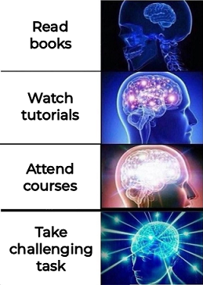

# Software Engineer Portfolio

> **Note!**  
> If you are looking for my CV, let me know in [LinkedIn](https://www.linkedin.com/in/ytj/)  

### Welcome to Developer's page!
The portfolio is created for any interested IT specialist such as Researcher, Recruiter, HR, PM or Technical Specialist. 
The portfolio shows interesting facts about my programming experience 
and provides additional topics which are not included in my CV:

- [About](#about)
- [Project Feedbacks](#project-feedbacks)
- [Leadership Skills](#leadership-skills)
- [Self-Education](#self-education)

# About

Having **Java** as a primary skill, I‘ve been doing commercial development for **5 years** so far. 
Working on Backend, REST API, Frontend, Cloud, Desktop apps,
I‘ve got experience with such **skills** as Java 8, JavaEE, Spring, AWS, SQL, JavaFX, Git, Scrum, Windows. 
I've come across different **stages** of development such as Research, Software Design, Implementation, Testing, Deployment. 
In addition to development itself, I had wide range of **responsibilities**: from Requirements Clarification to Product Release.

Thanks to fluent **English** and good soft skills, I‘m an efficient **Team Player** even in case of international teams. 
In fact, I’ve been communicating with foreign colleagues and stakeholders for more than 2 years already. 
I consider myself as a responsible person and also take care about others.
I have production experience of **Team Leading** and was a Mentor for education programs. 
Personally, I'm happy to share experience and help others. Colleagues often ask me for advice.

I'm always open to **feedback** about my work. 
On each project, my professional and personal qualities met or even exceeded expectations. 
At the same time, I see the ways for self-improvement and continue working on my hard, soft, and leadership skills. 
In the **future** I plan to take Lead Software Engineer position

# Project Feedbacks

### EPAM Systems
  - March 2023. 
    [Customer Feedback](resources/pictures/feedbacks/2023-March-EPAM-Summary-Feedback-from-Customers.PNG) 
    *Description:* 
    Half-year summary as part of constant feedback process. 
    Collected from **Product Owner**, **Scrum Master** (customer side) and **Delivery Manager** (EPAM side) feedbacks. 
    According to my Resource Manager (who shared more details in person), 
    feedbacks were quite positive and customers appreciated my contribution.
    As a result, I was paid an extra bonus.
  
  - September 2022. 
    [Customer Feedback](resources/pictures/feedbacks/2022-September-EPAM-Summary-Feedback-from-Customers.PNG) 
    *Description:* 
    Half-year summary as part of constant feedback process.
    Collected from **Product Owner**, **Scrum Master**, **Tech Lead** (customer side) feedbacks. 
    General impression is good: I did great job and also had some points to improve.
  
  - June 2022. 
    [Level-up Feedback 1](resources/pictures/feedbacks/2022-EPAM-LevelUp-Feedback-from-TeamLead.PNG) 
    and [Level-up Feedback 2](resources/pictures/feedbacks/2022-EPAM-LevelUp-Feedback-from-TechLead.PNG) 
    *Description*: 
    Part of assessment preparation. When I was applying for Senior level, 
    I asked **Team Lead** and **Tech Lead** (EPAM side) for feedback. 
    This helped assessment committee to decide whether I'm ready to be promoted. 
    According to these feedbacks I was recognized as a Senior.
    Finally, I got promoted.

  - June 2021. 
    [Project Feedback](resources/pictures/feedbacks/2021-June-Simple-Project-Feedback-from-TeamLead.PNG) 
    *Description:* 
    Half-year simple one as part of constant feedback process.
    Asked current project **Team Lead** (EPAM side). 
    Summing up, I was recognized as an excellent Key Developer and good Team Player.
  
  - January 2021. 
    [Project Feedback](resources/pictures/feedbacks/2021-January-Simple-Project-Feedback-from-Dev.PNG) 
    *Description:* 
    Simple one as part of constant feedback process.
    Asked current project **Developer** (EPAM side) where I played Lead Developer role. 
    That time, I didn't follow some coding best practices.
    In general, I was friendly Lead and quite effective Developer at the same time.

### Institute of Radio Astronomy

  - September 2020. 
    [Quit Project Feedback](resources/pictures/feedbacks/2020-September-RINANU-Quit-Project-Feedback-from-ProjectManager.PNG) 
    *Description:* 
    Quit feedback to sum up the entire work path on a project. 
    Asked **Project Manager** with whom I worked most of the time.
    There are original and English versions. 
    Leaving this project, I left successfully implemented application as well as positive impression about myself.

# Leadership Skills

#### Project Team Leading. Was the Lead Developer on a short-term project:

- Oct 2021 - Dec 2021. Managed 2 developers: work planning, meeting holding, development support.

#### EPAM Educational Programs. Participated as a Mentor in 2 runs:

- Jul 2022 - Oct 2022. Supported 5 students in Pre-Production program: RD Java Lab.
- Oct 2021 - Feb 2022. Supported 2 students in Pre-Production program: RD Java Lab. 

#### Private Tutoring. Worked as a Math teacher:

- 2017\. Supported 4 students: High Math for students.
- 2016\. Supported 8 students: Mathematics for schoolchildren.

# Self-education

#### EPAM English classes. Completed 9 trainings:

  - Apr 2023 - Jul 2023 (26 live sessions). English for Virtual Communication (B1+/B2/B2+).
  - Oct 2022 - Apr 2023 (41 live sessions). Business English (B1+/B2).
  - Sep 2022 - Nov 2022 (17 live sessions). IT Grammar in English (B1+/B2).
  - Jun 2022 - Jul 2022 (8 live sessions). English for Socializing (B1/B1+).
  - Mar 2022 - Jul 2022 (17 live sessions). IT Grammar in English (A2+/B1).
  - Jan 2022 - Feb 2022 (10 live sessions). Project Interviews in English (A2+/B1/B1+).
  - Nov 2021 - Dec 2021 (11 live sessions). Breaking the Language Barrier in English (A2+/B1).
  - Apr 2021 - Oct 2021 (40 live sessions). Business English (A2+/B1).
  - Mar 2021 - May 2022 (10 live sessions). English Speaking Club (B1/B2/C1/C2).

#### LinkedIn Learning. Completed 17 self-study courses:

  - 2023\. SQL vs NoSQL: Which Database Type Is Right for You?
  - 2023\. Learning REST APIs.
  - 2022\. Java EE: Servlets and JavaServer Pages (JSP).
  - 2022\. Learning Spring with Spring Boot.
    My [repository](https://github.com/Yevhen-Tkachenko-1/Spring-Boot-Demo-Application) for exercises.
  - 2022\. Spring Boot 2.0 Essential Training.
    My [repository](https://github.com/Yevhen-Tkachenko-1/Spring-Boot-Demo-Application) for exercises.
  - 2022\. AWS Essential Training for Developers.
  - 2022\. Learning Terraform.
  - 2022\. Git Essential Training: The Basics.
  - 2022\. Git: Branches, Merges, and Remotes.
  - 2021\. Spring: Framework in Depth.
    My [repository](https://github.com/Yevhen-Tkachenko-1/Spring-Demo-Application) for exercises.
  - 2021\. Building Full-Stack Apps with React and Spring.
  - 2021\. Spring: Test-Driven Development with JUnit.
  - 2021\. Learning Cloud Computing: Core Concepts.
  - 2021\. Advanced SQL for Query Tuning and Performance Optimization.
  - 2021\. Introduction to Linux.
  - 2021\. Practical Test-Driven Development for Java Programmers.
  - 2021\. Programming Foundations: Algorithms.
    My [repository](https://github.com/Yevhen-Tkachenko-1/Java-SDK-Research-and-Play) for exercises.

#### EPAM Learning. Completed educational program:

- Jun 2022 - Aug 2022. Cloud Platforms for developers - AWS Developer. 
  Completed 7 self-study modules with a Mentor review:
    - AWS Essential, AWS Account
    - IAM, S3, EC2, VPC
    - Cloud Formation

#### Book Library

- 2023\. Designing Data-Intensive Applications - Martin Kleppmann
- 2020\. Java XML and JSON: Document processing for Java SE - Jeff Friesen
- 2019\. Kotlin - Head First
- 2019\. Android Development - Head First
- 2019\. Design Patterns - Head First
- 2019\. Pro JavaFX 8: Building Desktop, Mobile, and Embedded Java Clients - Apress
- 2018\. Learn JavaFX 8: Building User Experience and Interfaces - Kishori Sharan
- 2018\. JavaFX 8: Introduction By Example - Apress
- 2018\. Java: A Beginner's Guide - Herbert Schildt
- 2018\. Effective Java - Joshua Bloch

# Programming habits

Some tips and approaches for programmers that I noticed and personally found useful:
- Working from office helps be more efficient and keep work-life balance.
- Refactoring helps fix a bug.
- Writing documentation helps better understand what you've done, 
  structurise gained knowledge and release memory. 
  Once important details are covered, you can forget about it and easily switch to the next task.