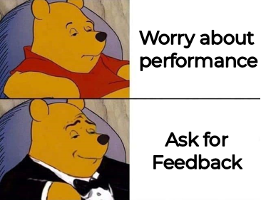
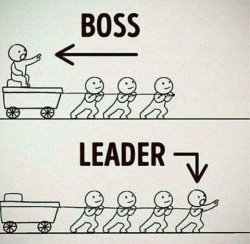
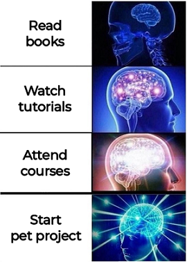

#### Updated Jan 2025

# Software Engineer Portfolio

#### Welcome to Developer's page!

The portfolio would be interesting for any IT specialist such as Researcher, Recruiter, HR, PM or Technical. 
Even if you have my CV, it's a good idea to review the following topics for more details:

- [**About**](#about)
- [**Project Feedbacks**](#project-feedbacks)
- [**Project Challenges**](#project-challenges)
- [**Rated Skills**](#rated-skills)
- [**Leadership Experience**](#leadership-experience)
- [**Self-Education**](#self-education)
- [**Career Promotions**](#career-promotions)
- [**Project Changing**](#project-changing)

# About

Having **Java** as a primary skill, I've been doing commercial development for **6 years** so far.
During this time I've mastered _Backend_ and come across different apps such as _Web_, _Cloud_, _Frontend_, _Desktop_.
Working on these apps, I've got considerable experience with _Java 8-17_, _JavaEE_, _Spring_, _AWS_, _SQL_, _NoSQL_, _JavaFX_, _Git_.

Regarding responsibilities, I'm familiar with all the main stages of engineering.
Working on _Technical Research_, _Software Design_, _Implementation_, _Testing_, _Deployment_,
I showed quite efficient work on the _Full Cycle_ development.
**Achievements** are 3 apps implemented from scratch and with 4 others I worked on support and extension.

Thanks to fluent **English** and good soft skills, I'm an efficient **Team Player** even in case of international teams.
Specifically, I have more than 3 years of cooperation with foreign colleagues and stakeholders.
I consider myself as a responsible person and also take care about others. 
I have production experience of **Team Leading** and was a Mentor for education programs.
In addition to team membership, I have more than 2 years of independent work as a **Key Developer**.

I'm always open to **Feedback** about my work. 
On each project, my professional and personal qualities met or even exceeded expectations.
At the same time, I see the ways for self-improvement and continue working on my _hard_, _soft_, and _leadership_ skills.
Currently, I'm recognized as a Senior and for the future I plan to take Lead Software Engineer position.

# Project Feedbacks

The table shows you context around. Please, follow links to see actual Feedback pages:

|   Date   |     Company     |                 Feedback Link                 | Reviewers                                                                                                                               | Description                                  |
|:--------:|:---------------:|:---------------------------------------------:|:----------------------------------------------------------------------------------------------------------------------------------------|----------------------------------------------|
| May 2024 | Global Logic |  [**Annual Performance Review**][F-may-2024]  | Project&nbsp;Manager&nbsp;(GlobalLogic) Project&nbsp;Director&nbsp;(GlobalLogic)                                                     | As part of regular Performance Review        |
| Sep 2023 | EPAM Systems | [**Half-year Feedback Summary**][F-sep-2023]  | Product&nbsp;Owner&nbsp;(customer) Team&nbsp;Lead&nbsp;(customer) Scrum&nbsp;Master&nbsp;(customer) Tech&nbsp;Lead&nbsp;(EPAM) | Summing up the entire work path on a project |
| Mar 2023 | EPAM Systems | [**Half-year Feedback Summary**][F-mar-2023]  | Product&nbsp;Owner&nbsp;(customer) Scrum&nbsp;Master&nbsp;(customer) Delivery&nbsp;Manager&nbsp;(EPAM)                            | As part of constant feedback process         |
| Sep 2022 | EPAM Systems | [**Half-year Feedback Summary**][F-sep-2022]  | Product&nbsp;Owner&nbsp;(customer) Team&nbsp;Lead&nbsp;(customer) Scrum&nbsp;Master&nbsp;(customer)                               | As part of constant feedback process         |
| Jun 2022 | EPAM Systems | [**Level-Up&nbsp;Feedbacks**][F-jun-jul-2022] | Team&nbsp;Lead&nbsp;(EPAM) Tech&nbsp;Lead&nbsp;(EPAM)                                                                                | As part of Level-Up assessment preparation   |
| Jun 2021 | EPAM Systems |     [**Half-year Feedback**][F-jun-2021]      | Team&nbsp;Lead&nbsp;(EPAM)                                                                                                              | As part of constant feedback process         |
| Jan 2021 | EPAM Systems |        [**Quit Feedback**][F-jan-2021]        | Developer&nbsp;(EPAM)                                                                                                                   | Summing up the entire work path on a project |
| Sep 2020 |   RINANU&ast;   |        [**Quit Feedback**][F-sep-2020]        | Project&nbsp;Manager&nbsp;(RINANU)                                                                                                      | Summing up the entire work path on a project |

&ast;_RINANU_ is [Ukrainian Product Department](http://rian.kharkov.ua/index.php/en/ 'http://rian.kharkov.ua/index.php/en/')
that produces Radar Station Prototypes including scientific research, hardware and software implementation.

[F-may-2024]: resources/pages/feedbacks/2024-May-Performance-Review.md '2024-May-Performance-Review.md'
[F-sep-2023]: resources/pages/feedbacks/2023-Sep-Summary-Feedback.md '2023-Sep-Summary-Feedback.md'
[F-mar-2023]: resources/pages/feedbacks/2023-Mar-Summary-Feedback.md '2023-Mar-Summary-Feedback.md'
[F-sep-2022]: resources/pages/feedbacks/2022-Sep-Summary-Feedback.md '2022-Sep-Summary-Feedback.md'
[F-jun-jul-2022]: resources/pages/feedbacks/2022-Jun-Jul-LevelUp-Feedbacks.md '2022-Jun-Jul-LevelUp-Feedbacks.md'
[F-jun-2021]: resources/pages/feedbacks/2021-Jun-Simple-Feedback.md '2021-Jun-Simple-Feedback.md'
[F-jan-2021]: resources/pages/feedbacks/2021-Jan-Quit-Feedback.md '2021-Jan-Quit-Feedback.md'
[F-sep-2020]: resources/pages/feedbacks/2020-Sep-Quit-Feedback.md '2020-Sep-Quit-Feedback.md'

# Project Challenges

The table shows you context around. Please, follow links to see full Stories:

| Year |     Company     |                         Story Link                          | Major Points                                                                                                                                                           | Achievements                                    |
|:----:|:---------------:|:-----------------------------------------------------------:|:-----------------------------------------------------------------------------------------------------------------------------------------------------------------------|:------------------------------------------------|
| 2021 | EPAM Systems |  [**My&nbsp;first&nbsp;Cloud&nbsp;Development**][STORY-5]   | POC, Refactoring, End-to-end&nbsp;Testing, Deployment&nbsp;Automation                                                                                                  | Implemented and released AWS-based Microservice |
| 2021 | EPAM Systems |   [**My&nbsp;first&nbsp;App&nbsp;Improvement**][STORY-4]    | Bug&nbsp;Fixing, Refactoring, Extension, Local&nbsp;Testing, Remote&nbsp;Debug, Knowledge&nbsp;Transfer                                                                | Improved and released AWS&nbsp;Lambda           |
| 2020 | EPAM Systems | [**My&nbsp;first&nbsp;project&nbsp;at&nbsp;EPAM**][STORY-3] | Requirements&nbsp;Clarification, Research, Development, Team&nbsp;Leading, Demo                                                                                        | Implemented&nbsp;Java&nbsp;Tool                 |
| 2019 |   RINANU&ast;   |     [**My&nbsp;first&nbsp;Complex&nbsp;App**][STORY-2]      | Technologies&nbsp;Research, Requirements&nbsp;Clarification, Architecture, Development, Maintenance, Expansion, Integration&nbsp;Testing, Packaging, Cross-Platforming | Implemented&nbsp;complex Desktop app            |
| 2018 |   RINANU&ast;   |    [**My&nbsp;first&nbsp;Commercial&nbsp;App**][STORY-1]    | Technical&nbsp;Research                                                                                                                                                | Implemented&nbsp;simple Desktop app             |

&ast;_RINANU_ is [Ukrainian Product Department](http://rian.kharkov.ua/index.php/en/ 'http://rian.kharkov.ua/index.php/en/')
that produces Radar Station Prototypes including scientific research, hardware and software implementation.

[STORY-5]: resources/pages/challenges/2021-MY-FIRST-CLOUD-DEVELOPMENT.md '2021-MY-FIRST-CLOUD-DEVELOPMENT.md' 
[STORY-4]: resources/pages/challenges/2021-MY-FIRST-APP-IMPROVEMENT.md '2021-MY-FIRST-APP-IMPROVEMENT.md'
[STORY-3]: resources/pages/challenges/2020-MY-FIRST-PROJECT-AT-EPAM.md '2020-MY-FIRST-PROJECT-AT-EPAM.md'
[STORY-2]: resources/pages/challenges/2019-MY-FIRST-COMPLEX-APP.md '2019-MY-FIRST-COMPLEX-APP.md'
[STORY-1]: resources/pages/challenges/2018-MY-FIRST-COMMERCIAL-APP.md '2018-MY-FIRST-COMMERCIAL-APP.md'

# Rated Skills

Details about my **hard skills**:

| Category              | Skill                   |  Level&ast;  | Project work |
|:----------------------|:------------------------|:------------:|:------------:|
|                       |                         |              |              |
| **Core Languages**    | **Java 8**              |    expert    |   6 years    |
|                       | **Java 9-17**           | intermediate |    1 year    |
|                       | **C#**                  |    entry     |   1 month    |
|                       | **C/C++**               |    entry     |   6 months   |
|                       | **TypeScript**          |    entry     |   6 months   |
|                       | **JavaScript**          |    entry     |   2 month    |
|                       | **Kotlin**              | theoretical  |              |
|                       |                         |              |              |
| **Development Areas** | **Backend**             |   advanced   |   4 years    |
|                       | **Desktop**             |   advanced   |   2 years    |
|                       | **Microservices**       | intermediate |   2 years    |
|                       | **Cloud**               | intermediate |   2 years    |
|                       | **Monoliths**           | intermediate |  1.5 years   |
|                       | **REST API**            | intermediate |  1.5 years   |
|                       | **Databases**           | intermediate |   2 years    |
|                       | **Fullstack**           |    entry     |    1 year    |
|                       | **Frontend**            |    entry     |   6 months   |
|                       |                         |              |              |
| **Backend**           | **Spring Core**         |   advanced   |   3 years    |
|                       | **Spring Boot**         | intermediate |   2 years    |
|                       | **Java EE**             | intermediate |  1.5 years   |
|                       | **Spring Data**         |    entry     |   6 months   |
|                       | **Spring Web**          |    entry     |   6 months   |
|                       | **Hibernate**           |    entry     |   6 month    |
|                       | **Apache Kafka**        |    entry     |   4 months   |
|                       | **Spring Security**     | theoretical  |              |
|                       |                         |              |              |
| **Databases**         | **SQL**                 |   advanced   |   3 years    |
|                       | **PostgreSQL**          | intermediate |  1.5 years   |
|                       | **OracleDB**            | intermediate |  1.5 years   |
|                       | **NoSQL**               | intermediate |    1 year    |
|                       | **InfluxDB**            |    entry     |   6 months   |
|                       | **DynamoDB**            |    entry     |   5 months   |
|                       |                         |              |              |
| **Clouds**            | **AWS Platform**        | intermediate |   2 years    |
|                       | **AWS Java SDK**        | intermediate |    1 year    |
|                       | **AWS Lambda**          | intermediate |    1 year    |
|                       | **AWS DynamoDB**        |    entry     |   3 months   |
|                       | **AWS SES**             |    entry     |   2 months   |
|                       | **AWS SQS**             |    entry     |   2 months   |
|                       | **AWS SNS**             |    entry     |   1 month    |
|                       | **AWS CloudWatch**      |    entry     |   1 month    |
|                       | **AWS EC2**             |    entry     |   1 month    |
|                       | **AWS S3**              |    entry     |   1 month    |
|                       | **AWS ECS**             | theoretical  |              |
|                       | **AWS EKS**             | theoretical  |              |
|                       |                         |              |              |
| **Frontend**          | **JavaFX**              |   advanced   |   2 years    |
|                       | **UI/UX**               | intermediate |  1.5 years   |
|                       | **2D/3D graphics**      | intermediate |    1 year    |
|                       | **JSON/XML**            | intermediate |    1 year    |
|                       | **HTML/CSS**            |    entry     |   6 months   |
|                       | **AngularJS 2**         |    entry     |   6 months   |
|                       | **docx4j/xlsx4j**       |    entry     |   5 months   |
|                       | **Vue.js**              |    entry     |   2 months   |
|                       |                         |              |              |
| **Testing**           | **JUnit**               |   advanced   |   3 years    |
|                       | **Postman**             | intermediate |    1 year    |
|                       | **JMockit**             |    entry     |   6 months   |
|                       | **Mockito**             |    entry     |   5 months   |
|                       | **JProfiler**           |    entry     |   1 month    |
|                       | **OpenTelemetry**       |    entry     |   1 month    |
|                       | **Jaeger**              |    entry     |   1 month    |
|                       |                         |              |              |
| **CI/CD**             | **Git**                 |   advanced   |   4 years    |
|                       | **GitLab**              | intermediate |   2 years    |
|                       | **JBoss**               | intermediate |   2 years    |
|                       | **Gradle**              | intermediate |   2 years    |
|                       | **Maven**               | intermediate |   2 years    |
|                       | **GitHub**              | intermediate |    1 year    |
|                       | **Azure DevOps**        | intermediate |    1 year    |
|                       | **Docker**              |    entry     |   8 months   |
|                       | **Kubernetes**          |    entry     |   6 months   |
|                       | **Terraform**           |    entry     |   6 months   |
|                       |                         |              |              |
| **Software & Tools**  | **Windows**             |   advanced   |  5.5 years   |
|                       | **IntelliJ IDEA**       |   advanced   |   4 years    |
|                       | **Jira**                |   advanced   |   3 years    |
|                       | **Eclipse IDE**         |   advanced   |  2.5 years   |
|                       | **SQL Developer**       | intermediate |   2 years    |
|                       | **Command Line**        | intermediate |   2 years    |
|                       | **Confluence**          | intermediate |   2 years    |
|                       | **pgAdmin**             | intermediate |    1 year    |
|                       | **Linux**               | intermediate |    1 year    |
|                       | **Tilt Dev**            | intermediate |  10 months   |
|                       | **Node-RED**            |    entry     |   5 months   |
|                       | **VS Code**             |    entry     |   4 months   |
|                       | **Mermaid**             |    entry     |   3 months   |
|                       | **GitHub Copilot**      | non-project  |              |
|                       |                         |              |              |
| **General**           | **OOP**                 |    expert    |   6 years    |
|                       | **Clean Code**          |    expert    |   5 years    |
|                       | **Design Patterns**     |   advanced   |   4 years    |
|                       | **Scrum**               |   advanced   |  3.5 years   |
|                       | **Mathematics**         |    expert    |   3 years    |
|                       | **Product Development** |   advanced   |  2.5 years   |
|                       | **Outsourcing**         | intermediate |   2 years    |
|                       | **Outstaffing**         | intermediate |   2 years    |
|                       | **Kanban**              | intermediate |   2 years    |
|                       | **Waterfall**           | intermediate |    1 year    |
|                       | **Multithreading**      | intermediate |    1 year    |
|                       |                         |              |              |
| **Domains**           | **Radar Stations**      |   advanced   |  2.5 years   |
|                       | **Banking System**      | intermediate |   2 years    |
|                       | **Asset Management**    | intermediate |    1 year    |
|                       | **AWS Configuration**   | intermediate |    1 year    |

&ast;used next levels:
- **theoretical** or **non-project** - limited by self-education and pet project work.
  Able to work in slow pace with help of documentation and colleagues.
- **entry** - several months of project work with basic theoretical knowledge.
  Able to work in moderate pace with help of documentation and peers review.
- **intermediate** - about year of project work with good theoretical knowledge.
  Able to work in a regular pace independently.
- **advanced** - several years of project work with wide theoretical knowledge.
  Able to work in fast pace and ready to consult others.
- **expert** - several years of project work with wide and deep theoretical knowledge.
  Able to work in fast pace and free to consult others.

# Leadership Experience

Cases where I organized/supported processes for work and education:

| Date                                    | Type                 | Activity                            | Contribution                                                                                                                                                        |
|:----------------------------------------|----------------------|-------------------------------------|---------------------------------------------------------------------------------------------------------------------------------------------------------------------|
| Oct&nbsp;2023                           | Project&nbsp;work    | **Knowledge&nbsp;Transfer**         | Conducted 3 cross-team meetings where presented technical details of our team implementations                                                                       |
| Sep&nbsp;2023                           | Project&nbsp;work    | **Onboarding**                      | Supported the developer to get started in our team                                                                                                                  |
| Oct&nbsp;2021&nbsp;-&nbsp;Sep&nbsp;2023 | Project&nbsp;work    | **Mentoring**                       | Provided regular support for the developer in our team                                                                                                              |
| Sep&nbsp;2023                           | Non&#8209;commercial | **Interviewing**                    | Conducted mock interviews to help EPAM colleagues get position on a project                                                                                         |
| Jul&nbsp;2022&nbsp;-&nbsp;Oct&nbsp;2022 | Non&#8209;commercial | **Mentoring**                       | Played a Mentor role in the EPAM educational program&ast; _RD Java Lab Summer 2022_. Supported 5 students                                                           |
| Oct&nbsp;2021&nbsp;-&nbsp;Feb&nbsp;2022 | Non&#8209;commercial | **Mentoring**                       | Played a Mentor role in the EPAM educational program&ast; _RD Java Lab Autumn 2021_. Supported 2 students                                                           |
| Oct&nbsp;2020&nbsp;-&nbsp;Dec&nbsp;2020 | Project&nbsp;work    | **Team&nbsp;Leading**               | Held the position of Lead Developer in a team of 3 devs. Was in charge of requirements clarification, work planning, development, daily meetings, technical support |
| Sep&nbsp;2016&nbsp;-&nbsp;Feb&nbsp;2018 | Non&#8209;IT         | **Private&nbsp;Tutoring&ast;&ast;** | Worked as a mathematics teacher. Supported 12 students by conducting ~ 650 offline classes in total                                                                 |

&ast;_EPAM educational program_ is pre-production activity that consists of theoretical lectures and practical tasks.
During task completion each Mentee is assigned to specific Mentor.
That time Mentor supports students by organizing one-to-one sessions to discuss 
task requirements and implementation way, answer questions, check progress, accept tasks.
Also, there is offline support using chatting, regular code review and app local testing.
Finally, Mentor provides feedback on the Mentees performance.

&ast;&ast;_private tutoring_ is support for students while they are studying at school or university.
It includes help with homework, clarification of difficult points, exam preparation.

# Self-education

Working on my hard and soft skills, have next achievements so far:

#### Business English. Completed 13 live trainings:

|     Date | Name                               | Level       |    Efforts | Duration | Provider     |
|---------:|:-----------------------------------|:------------|-----------:|---------:|--------------|
| Oct 2024 | **Business Communication**         | B1+/B2/B2+  | 40 lessons | 5 months | GlobalLogic  |
| Aug 2024 | **Speaking Club**                  | B1+/B2/B2+  | 12 lessons | 2 months | AP Education |
| Oct 2023 | **IT Communication**               | B2/B2+      | 17 lessons | 2 months | EPAM Systems |
| Sep 2023 | **Presenting and Public Speaking** | B1+/B2/B2+  | 20 lessons | 3 months | EPAM Systems |
| Jul 2023 | **Virtual Communication**          | B1+/B2/B2+  | 26 lessons | 4 months | EPAM Systems |
| Apr 2023 | **Business Communication**         | B1+/B2      | 41 lessons | 7 months | EPAM Systems |
| Nov 2022 | **IT Grammar**                     | B1+/B2      | 17 lessons | 3 months | EPAM Systems |
| Jul 2022 | **Small Talks**                    | B1/B1+      |  8 lessons | 2 months | EPAM Systems |
| Jul 2022 | **IT Grammar**                     | A2+/B1      | 17 lessons | 4 months | EPAM Systems |
| May 2022 | **Speaking Club**                  | B1/B2/C1/C2 | 10 lessons | 3 months | EPAM Systems |
| Feb 2022 | **Project Interviews**             | A2+/B1/B1+  | 10 lessons | 2 months | EPAM Systems |
| Dec 2021 | **Breaking the Language Barrier**  | A2+/B1      | 11 lessons | 2 months | EPAM Systems |
| Oct 2021 | **Business Communication**         | A2+/B1      | 40 lessons | 7 months | EPAM Systems |

#### Software Engineering. Completed 3 educational programs:

|     Date | Name                                                                      | Provider               | Certificate                         | Level        | Type                         |       Efforts | Practice                                                 | Acceptance      |
|---------:|:--------------------------------------------------------------------------|------------------------|-------------------------------------|--------------|:-----------------------------|--------------:|----------------------------------------------------------|:----------------|
| May 2024 | **GenAI:&nbsp;Assisted&nbsp;Programming with&nbsp;GitHub&nbsp;Copilot**   | GlobalLogic            | [Global Logic][GlobalLogic-Cert-11] | Beginner     | Mixed&nbsp;training          | 10&nbsp;hours | [Repository][GitHub-Repo-01]                             | Quiz            | 
| Nov 2023 | [**AWS&nbsp;Certified&nbsp;Developer - Associate**][ACloudGuru-Course-01] | A&nbsp;Cloud&nbsp;Guru | [AWS][AWS-Cert-01]                  | Intermediate | Self&#8209;study&nbsp;course | 42&nbsp;hours | 14&nbsp;Labs&nbsp;in&nbsp;Playground, 4&nbsp;Exams       | 10&nbsp;Quizzes |
| Aug 2022 | **CloudX&nbsp;Associate: AWS&nbsp;Developer**                             | EPAM&nbsp;Systems      |                                     | Beginner     | Educational&nbsp;program     | 30&nbsp;hours | 5&nbsp;Labs&nbsp;in AWS&nbsp;Free&nbsp;Tier&nbsp;account | Mentor review   |

[ACloudGuru-Course-01]: https://learn.acloud.guru/course/aws-certified-developer-associate/dashboard 'https://learn.acloud.guru/course/aws-certified-developer-associate/dashboard'

[GlobalLogic-Cert-11]: resources/certificates/GlobalLogic/11_2024-05-27_Assisted-programming-with-GitHub-Copilot.pdf
[AWS-Cert-01]: resources/certificates/AWS/01_2023-12-06_AWS-Certified-Developer-Associate.pdf

[GitHub-Repo-01]: https://github.com/Yevhen-Tkachenko-1/GitHub-Copilot-for-Java-Demo 'https://github.com/Yevhen-Tkachenko-1/GitHub-Copilot-for-Java-Demo'

#### LinkedIn Learning. Completed 45 self-study courses:

| Category             |            Completed | Title                                                                                    | Practice                                      |    Level     |       Certificate        |
|----------------------|---------------------:|:-----------------------------------------------------------------------------------------|:----------------------------------------------|:------------:|:------------------------:|
|                      |                      |                                                                                          |                                               |              |                          |
| **Backend**          |             Dec 2024 | [**JPA and Hibernate**][LinkedIn-Course-44]                                              | [Repository][GitHub-Repo-Hibernate]           | Intermediate | [File][LinkedIn-Cert-44] |
|                      |             Jul 2024 | [**Complete Guide to Apache Kafka**][LinkedIn-Course-40]                                 | [Repository][GitHub-Repo-Kafka]               |   Beginner   | [File][LinkedIn-Cert-40] |
|                      |             Oct 2023 | [**Microservices: Security**][LinkedIn-Course-33]                                        |                                               |   Advanced   | [File][LinkedIn-Cert-33] |
|                      |             Oct 2023 | [**Microservices: Design Patterns**][LinkedIn-Course-32]                                 |                                               |   Advanced   | [File][LinkedIn-Cert-32] |
|                      |             Oct 2023 | [**Microservices: Foundations**][LinkedIn-Course-31]                                     |                                               |   Advanced   | [File][LinkedIn-Cert-31] |
|                      |             Sep 2023 | [**Java Database Access with Hibernate**][LinkedIn-Course-27]                            |                                               | Intermediate | [File][LinkedIn-Cert-27] |
|                      |             Apr 2023 | [**Learning REST APIs**][LinkedIn-Course-17]                                             |                                               |   Beginner   | [File][LinkedIn-Cert-17] |
|                      |             Jul 2022 | [**Java EE: Servlets and JavaServer Pages (JSP)**][LinkedIn-Course-10]                   |                                               | Intermediate | [File][LinkedIn-Cert-10] |
|                      |                      |                                                                                          |                                               |              |                          |
| **Generative AI**    |             May 2024 | [**GitHub Copilot: First Look**][LinkedIn-Course-39]                                     | [Repository][GitHub-Repo-Copilot]             | Intermediate | [File][LinkedIn-Cert-39] |
|                      |             Feb 2024 | [**Practical GitHub Copilot**][LinkedIn-Course-38]                                       |                                               |   Beginner   | [File][LinkedIn-Cert-38] |
|                      |             Feb 2024 | [**Pair Programming with AI**][LinkedIn-Course-37]                                       |                                               |   Beginner   | [File][LinkedIn-Cert-37] |
|                      |             Jan 2024 | [**Introduction to Prompt Engineering for Generative AI**][LinkedIn-Course-36]           |                                               |   Beginner   | [File][LinkedIn-Cert-36] |
|                      |             Nov 2023 | [**Ethics in the Age of Generative AI**][LinkedIn-Course-35]                             |                                               |   Beginner   | [File][LinkedIn-Cert-35] |
|                      |             Nov 2023 | [**What Is Generative AI?**][LinkedIn-Course-34]                                         |                                               |   Beginner   | [File][LinkedIn-Cert-34] |
|                      |                      |                                                                                          |                                               |              |                          |
| **Spring Framework** |             Aug 2024 | [**Spring Security**][LinkedIn-Course-41]                                                | [Repository][GitHub-Repo-Spring-Security]     | Intermediate | [File][LinkedIn-Cert-41] |
|                      |             Sep 2023 | [**Extending, Securing, and Dockerizing Spring Boot Microservices**][LinkedIn-Course-30] |                                               |   Advanced   | [File][LinkedIn-Cert-30] |
|                      |             Sep 2023 | [**Spring 5.0 and Spring Boot 2.0 New Features**][LinkedIn-Course-26]                    |                                               | Intermediate | [File][LinkedIn-Cert-26] |
|                      |             Sep 2023 | [**Spring: Spring Data 2**][LinkedIn-Course-25]                                          |                                               | Intermediate | [File][LinkedIn-Cert-25] |
|                      |             Sep 2023 | [**Effective Integration Testing with Spring Boot**][LinkedIn-Course-23]                 |                                               |   Advanced   | [File][LinkedIn-Cert-23] |
|                      |             Aug 2023 | [**Creating Your First Spring Boot Microservice**][LinkedIn-Course-18]                   | [Repository][GitHub-Repo-Spring-Microservice] | Intermediate | [File][LinkedIn-Cert-18] |
|                      |             Sep 2022 | [**Spring Boot 2.0 Essential Training**][LinkedIn-Course-15]                             |                                               | Intermediate | [File][LinkedIn-Cert-15] |
|                      | Sep 2022 Aug 2021 | [**Learning Spring with Spring Boot**][LinkedIn-Course-14]                               | [Repository][GitHub-Repo-Spring-Boot]         |   Beginner   | [File][LinkedIn-Cert-14] |
|                      |             Oct 2021 | [**Building Full-Stack Apps with React and Spring**][LinkedIn-Course-08]                 | [Repository][GitHub-Repo-Spring-React]        | Intermediate | [File][LinkedIn-Cert-08] |
|                      |             Aug 2021 | [**Spring: Framework in Depth**][LinkedIn-Course-06]                                     | [Repository][GitHub-Repo-Spring-Core]         | Intermediate | [File][LinkedIn-Cert-06] |
|                      |             Aug 2021 | [**Spring: Test-Driven Development with JUnit**][LinkedIn-Course-05]                     |                                               | Intermediate | [File][LinkedIn-Cert-05] |
|                      |                      |                                                                                          |                                               |              |                          |
| **CI/CD**            |             Oct 2024 | [**Docker: You First Project**][LinkedIn-Course-42]                                      | [Repository][GitHub-Repo-Docker]              | Intermediate | [File][LinkedIn-Cert-42] |
|                      |             Sep 2023 | [**Learning Kubernetes**][LinkedIn-Course-21]                                            |                                               | Intermediate | [File][LinkedIn-Cert-21] |
|                      |             Aug 2023 | [**Learning Docker**][LinkedIn-Course-20]                                                | [Repository][GitHub-Repo-Docker]              |   Beginner   | [File][LinkedIn-Cert-20] |
|                      |             Sep 2022 | [**Git: Branches, Merges, and Remotes**][LinkedIn-Course-13]                             |                                               |   Beginner   | [File][LinkedIn-Cert-13] |
|                      |             Aug 2022 | [**Git Essential Training: The Basics**][LinkedIn-Course-11]                             |                                               |   Beginner   | [File][LinkedIn-Cert-11] |
|                      |             Nov 2021 | [**Learning Terraform**][LinkedIn-Course-09]                                             |                                               |   Beginner   | [File][LinkedIn-Cert-09] |
|                      |             Aug 2021 | [**Introduction to Linux**][LinkedIn-Course-04]                                          |                                               |   Beginner   | [File][LinkedIn-Cert-04] |
|                      |                      |                                                                                          |                                               |              |                          |
| **Java**             |             Sep 2023 | [**Parallel Programming with Java**][LinkedIn-Course-29]                                 |                                               |   Advanced   | [File][LinkedIn-Cert-29] |
|                      |             Sep 2023 | [**Concurrent Programming with Java**][LinkedIn-Course-28]                               | [Repository][GitHub-Repo-Java-Multithreading] |   Advanced   | [File][LinkedIn-Cert-28] |
|                      |             Aug 2021 | [**Programming Foundations: Algorithms**][LinkedIn-Course-03]                            |                                               |   Beginner   | [File][LinkedIn-Cert-03] |
|                      |             Aug 2021 | [**Practical Test-Driven Development for Java Programmers**][LinkedIn-Course-02]         |                                               | Intermediate | [File][LinkedIn-Cert-02] |
|                      |                      |                                                                                          |                                               |              |                          |
| **Cloud**            |             May 2025 | [**GCP Load Balancing**][LinkedIn-Course-45]                                             |                                               |   Advanced   | [File][LinkedIn-Cert-45] |
|                      |             Sep 2023 | [**AWS for Developers: SNS, SQS, and SWF**][LinkedIn-Course-24]                          |                                               |   Advanced   | [File][LinkedIn-Cert-24] |
|                      |             Sep 2023 | [**Exam Prep: Microsoft Azure Fundamentals**][LinkedIn-Course-22]                        |                                               |   Beginner   | [File][LinkedIn-Cert-22] |
|                      |             Aug 2022 | [**AWS Essential Training for Developers**][LinkedIn-Course-12]                          |                                               |   Beginner   | [File][LinkedIn-Cert-12] |
|                      | Jul 2021 May 2021 | [**Learning Cloud Computing: Core Concepts**][LinkedIn-Course-01]                        |                                               |   Beginner   | [File][LinkedIn-Cert-01] |
|                      |                      |                                                                                          |                                               |              |                          |
| **SQL**              |             Oct 2024 | [**PostgreSQL Essential Training**][LinkedIn-Course-43]                                  | [Repository][GitHub-Repo-PostgreSQL]          | Intermediate | [File][LinkedIn-Cert-43] |
|                      |             Aug 2023 | [**SQL Essential Training**][LinkedIn-Course-19]                                         | [Repository][GitHub-Repo-SQLite]              |   Beginner   | [File][LinkedIn-Cert-19] |
|                      |             Mar 2023 | [**SQL vs NoSQL: Which Database Type Is Right for You?**][LinkedIn-Course-16]            |                                               | Intermediate | [File][LinkedIn-Cert-16] |
|                      |             Oct 2021 | [**Advanced SQL for Query Tuning and Performance Optimization**][LinkedIn-Course-07]     |                                               |   Advanced   | [File][LinkedIn-Cert-07] |

[LinkedIn-Course-01]: https://www.linkedin.com/learning/learning-cloud-computing-core-concepts-13966302 'https://www.linkedin.com/learning/learning-cloud-computing-core-concepts-13966302'
[LinkedIn-Course-02]: https://www.linkedin.com/learning/practical-test-driven-development-for-java-programmers 'https://www.linkedin.com/learning/practical-test-driven-development-for-java-programmers'
[LinkedIn-Course-03]: https://www.linkedin.com/learning/programming-foundations-algorithms 'https://www.linkedin.com/learning/programming-foundations-algorithms'
[LinkedIn-Course-04]: https://www.linkedin.com/learning/introduction-to-linux 'https://www.linkedin.com/learning/introduction-to-linux'
[LinkedIn-Course-05]: https://www.linkedin.com/learning/spring-test-driven-development-with-junit 'https://www.linkedin.com/learning/spring-test-driven-development-with-junit'
[LinkedIn-Course-06]: https://www.linkedin.com/learning/spring-framework-in-depth-2 'https://www.linkedin.com/learning/spring-framework-in-depth-2'
[LinkedIn-Course-07]: https://www.linkedin.com/learning/advanced-sql-for-query-tuning-and-performance-optimization 'https://www.linkedin.com/learning/advanced-sql-for-query-tuning-and-performance-optimization'
[LinkedIn-Course-08]: https://www.linkedin.com/learning/building-full-stack-apps-with-react-and-spring 'https://www.linkedin.com/learning/building-full-stack-apps-with-react-and-spring'
[LinkedIn-Course-09]: https://www.linkedin.com/learning/learning-terraform-2020 'https://www.linkedin.com/learning/learning-terraform-2020'
[LinkedIn-Course-10]: https://www.linkedin.com/learning/java-ee-servlets-and-javaserver-pages-jsp 'https://www.linkedin.com/learning/java-ee-servlets-and-javaserver-pages-jsp'
[LinkedIn-Course-11]: https://www.linkedin.com/learning/git-essential-training-the-basics-2019 'https://www.linkedin.com/learning/git-essential-training-the-basics-2019'
[LinkedIn-Course-12]: https://www.linkedin.com/learning/aws-essential-training-for-developers-2019 'https://www.linkedin.com/learning/aws-essential-training-for-developers-2019'
[LinkedIn-Course-13]: https://www.linkedin.com/learning/git-branches-merges-and-remotes 'https://www.linkedin.com/learning/git-branches-merges-and-remotes'
[LinkedIn-Course-14]: https://www.linkedin.com/learning/learning-spring-with-spring-boot-13886371 'https://www.linkedin.com/learning/learning-spring-with-spring-boot-13886371'
[LinkedIn-Course-15]: https://www.linkedin.com/learning/spring-boot-2-0-essential-training-2 'https://www.linkedin.com/learning/spring-boot-2-0-essential-training-2'
[LinkedIn-Course-16]: https://www.linkedin.com/learning/sql-vs-nosql-which-database-type-is-right-for-you 'https://www.linkedin.com/learning/sql-vs-nosql-which-database-type-is-right-for-you'
[LinkedIn-Course-17]: https://www.linkedin.com/learning/learning-rest-apis 'https://www.linkedin.com/learning/learning-rest-apis'
[LinkedIn-Course-18]: https://www.linkedin.com/learning/creating-your-first-spring-boot-microservice 'https://www.linkedin.com/learning/creating-your-first-spring-boot-microservice'
[LinkedIn-Course-19]: https://www.linkedin.com/learning/sql-essential-training-20685933 'https://www.linkedin.com/learning/sql-essential-training-20685933'
[LinkedIn-Course-20]: https://www.linkedin.com/learning/learning-docker-17236240 'https://www.linkedin.com/learning/learning-docker-17236240'
[LinkedIn-Course-21]: https://www.linkedin.com/learning/learning-kubernetes-16086900 'https://www.linkedin.com/learning/learning-kubernetes-16086900'
[LinkedIn-Course-22]: https://www.linkedin.com/learning/exam-prep-microsoft-azure-fundamentals-az-900-2020 'https://www.linkedin.com/learning/exam-prep-microsoft-azure-fundamentals-az-900-2020'
[LinkedIn-Course-23]: https://www.linkedin.com/learning/advanced-spring-effective-integration-testing-with-spring-boot 'https://www.linkedin.com/learning/advanced-spring-effective-integration-testing-with-spring-boot'
[LinkedIn-Course-24]: https://www.linkedin.com/learning/aws-for-developers-sns-sqs-and-swf 'https://www.linkedin.com/learning/aws-for-developers-sns-sqs-and-swf'
[LinkedIn-Course-25]: https://www.linkedin.com/learning/spring-spring-data-2-2017 'https://www.linkedin.com/learning/spring-spring-data-2-2017'
[LinkedIn-Course-26]: https://www.linkedin.com/learning/spring-5-0-and-spring-boot-2-0-new-features 'https://www.linkedin.com/learning/spring-5-0-and-spring-boot-2-0-new-features'
[LinkedIn-Course-27]: https://www.linkedin.com/learning/java-database-access-with-hibernate 'https://www.linkedin.com/learning/java-database-access-with-hibernate'
[LinkedIn-Course-28]: https://www.linkedin.com/learning/parallel-and-concurrent-programming-with-java-1 'https://www.linkedin.com/learning/parallel-and-concurrent-programming-with-java-1'
[LinkedIn-Course-29]: https://www.linkedin.com/learning/parallel-and-concurrent-programming-with-java-2 'https://www.linkedin.com/learning/parallel-and-concurrent-programming-with-java-2'
[LinkedIn-Course-30]: https://www.linkedin.com/learning/extending-securing-and-dockerizing-spring-boot-microservices 'https://www.linkedin.com/learning/extending-securing-and-dockerizing-spring-boot-microservices'
[LinkedIn-Course-31]: https://www.linkedin.com/learning/microservices-foundations-2018 'https://www.linkedin.com/learning/microservices-foundations-2018'
[LinkedIn-Course-32]: https://www.linkedin.com/learning/microservices-design-patterns-23454771 'https://www.linkedin.com/learning/microservices-design-patterns-23454771'
[LinkedIn-Course-33]: https://www.linkedin.com/learning/microservices-security 'https://www.linkedin.com/learning/microservices-security'
[LinkedIn-Course-34]: https://www.linkedin.com/learning/what-is-generative-ai 'https://www.linkedin.com/learning/what-is-generative-ai'
[LinkedIn-Course-35]: https://www.linkedin.com/learning/ethics-in-the-age-of-generative-ai 'https://www.linkedin.com/learning/ethics-in-the-age-of-generative-ai'
[LinkedIn-Course-36]: https://www.linkedin.com/learning/introduction-to-prompt-engineering-for-generative-ai 'https://www.linkedin.com/learning/introduction-to-prompt-engineering-for-generative-ai'
[LinkedIn-Course-37]: https://www.linkedin.com/learning/pair-programming-with-ai 'https://www.linkedin.com/learning/pair-programming-with-ai'
[LinkedIn-Course-38]: https://www.linkedin.com/learning/practical-github-copilot 'https://www.linkedin.com/learning/practical-github-copilot'
[LinkedIn-Course-39]: https://www.linkedin.com/learning/github-copilot-first-look 'https://www.linkedin.com/learning/github-copilot-first-look'
[LinkedIn-Course-40]: https://www.linkedin.com/learning/complete-guide-to-apache-kafka-for-beginners 'https://www.linkedin.com/learning/complete-guide-to-apache-kafka-for-beginners'
[LinkedIn-Course-41]: https://www.linkedin.com/learning/spring-spring-security-15832928 'https://www.linkedin.com/learning/spring-spring-security-15832928'
[LinkedIn-Course-42]: https://www.linkedin.com/learning/docker-your-first-project 'https://www.linkedin.com/learning/docker-your-first-project'
[LinkedIn-Course-43]: https://www.linkedin.com/learning/postgresql-essential-training-22611610 'https://www.linkedin.com/learning/postgresql-essential-training-22611610'
[LinkedIn-Course-44]: https://www.linkedin.com/learning/java-persistence-with-jpa-and-hibernate 'https://www.linkedin.com/learning/java-persistence-with-jpa-and-hibernate'
[LinkedIn-Course-45]: https://www.linkedin.com/learning/spring-cloud-load-balancing 'https://www.linkedin.com/learning/spring-cloud-load-balancing'

[GitHub-Repo-Copilot]: https://github.com/Yevhen-Tkachenko-1/GitHub-Copilot-for-Java-Demo 'https://github.com/Yevhen-Tkachenko-1/GitHub-Copilot-for-Java-Demo'
[GitHub-Repo-Docker]: https://github.com/Yevhen-Tkachenko-1/Docker-Containerization-Demo 'https://github.com/Yevhen-Tkachenko-1/Docker-Containerization-Demo'
[GitHub-Repo-Hibernate]: https://github.com/Yevhen-Tkachenko-1/Hibernate-ORM-Demo 'https://github.com/Yevhen-Tkachenko-1/Hibernate-ORM-Demo'
[GitHub-Repo-Java]: https://github.com/Yevhen-Tkachenko-1/Java-SDK-Research-and-Play 'https://github.com/Yevhen-Tkachenko-1/Java-SDK-Research-and-Play'
[GitHub-Repo-Java-Multithreading]: https://github.com/Yevhen-Tkachenko-1/Java-SDK-Research-and-Play/blob/main/Multithreading-Demo/README.md 'https://github.com/Yevhen-Tkachenko-1/Java-SDK-Research-and-Play/blob/main/Multithreading-Demo/README.md'
[GitHub-Repo-Kafka]: https://github.com/Yevhen-Tkachenko-1/Apache-Kafka-Demo 'https://github.com/Yevhen-Tkachenko-1/Apache-Kafka-Demo'
[GitHub-Repo-PostgreSQL]: https://github.com/Yevhen-Tkachenko-1/SQL-Development-Demo/tree/main/PostgreSQL 'https://github.com/Yevhen-Tkachenko-1/SQL-Development-Demo/tree/main/PostgreSQL'
[GitHub-Repo-Spring-Boot]: https://github.com/Yevhen-Tkachenko-1/Spring-Boot-Demo/tree/main/Hotel-Spring-Boot-App 'https://github.com/Yevhen-Tkachenko-1/Spring-Boot-Demo/tree/main/Hotel-Spring-Boot-App'
[GitHub-Repo-Spring-Core]: https://github.com/Yevhen-Tkachenko-1/Spring-Framework-Demo/blob/main/Spring-Core/README.md 'https://github.com/Yevhen-Tkachenko-1/Spring-Framework-Demo/blob/main/Spring-Core/README.md'
[GitHub-Repo-Spring-Microservice]: https://github.com/Yevhen-Tkachenko-1/Spring-Boot-Demo-Microservice-with-MongoDB 'https://github.com/Yevhen-Tkachenko-1/Spring-Boot-Demo-Microservice-with-MongoDB'
[GitHub-Repo-Spring-React]: https://github.com/Yevhen-Tkachenko-1/Full-Stack-Demo-Application-with-Spring-and-React 'https://github.com/Yevhen-Tkachenko-1/Full-Stack-Demo-Application-with-Spring-and-React'
[GitHub-Repo-Spring-Security]: https://github.com/Yevhen-Tkachenko-1/Spring-Boot-Demo/tree/main/Marketplace-Spring-Security-App 'https://github.com/Yevhen-Tkachenko-1/Spring-Boot-Demo/tree/main/Marketplace-Spring-Security-App'
[GitHub-Repo-SQLite]: https://github.com/Yevhen-Tkachenko-1/SQL-Development-Demo/tree/main/SQLite 'https://github.com/Yevhen-Tkachenko-1/SQL-Development-Demo/tree/main/SQLite'

[LinkedIn-Cert-01]: resources/certificates/LinkedIn/01-CertificateOfCompletion_Learning%20Cloud%20Computing%20Core%20Concepts%20-%202021,%202019.pdf
[LinkedIn-Cert-02]: resources/certificates/LinkedIn/02-CertificateOfCompletion_Practical%20TestDriven%20Development%20for%20Java%20Programmers.pdf
[LinkedIn-Cert-03]: resources/certificates/LinkedIn/03-CertificateOfCompletion_Programming%20Foundations%20Algorithms.pdf
[LinkedIn-Cert-04]: resources/certificates/LinkedIn/04-CertificateOfCompletion_Introduction%20to%20Linux.pdf
[LinkedIn-Cert-05]: resources/certificates/LinkedIn/05-CertificateOfCompletion_Spring%20TestDriven%20Development%20with%20JUnit.pdf
[LinkedIn-Cert-06]: resources/certificates/LinkedIn/06-CertificateOfCompletion_Spring%20Framework%20in%20Depth.pdf
[LinkedIn-Cert-07]: resources/certificates/LinkedIn/07-CertificateOfCompletion_Advanced%20SQL%20for%20Query%20Tuning%20and%20Performance%20Optimization.pdf
[LinkedIn-Cert-08]: resources/certificates/LinkedIn/08-CertificateOfCompletion_Building%20FullStack%20Apps%20with%20React%20and%20Spring.pdf
[LinkedIn-Cert-09]: resources/certificates/LinkedIn/09-CertificateOfCompletion_Learning%20Terraform%202020.pdf
[LinkedIn-Cert-10]: resources/certificates/LinkedIn/10-CertificateOfCompletion_Java%20EE%20Servlets%20and%20JavaServer%20Pages%20JSP.pdf
[LinkedIn-Cert-11]: resources/certificates/LinkedIn/11-CertificateOfCompletion_Git%20Essential%20Training%20The%20Basics%202019.pdf
[LinkedIn-Cert-12]: resources/certificates/LinkedIn/12-CertificateOfCompletion_AWS%20Essential%20Training%20for%20Developers%202019.pdf
[LinkedIn-Cert-13]: resources/certificates/LinkedIn/13-CertificateOfCompletion_Git%20Branches%20Merges%20and%20Remotes.pdf
[LinkedIn-Cert-14]: resources/certificates/LinkedIn/14-CertificateOfCompletion_Learning%20Spring%20with%20Spring%20Boot%20-%202022,%202019.pdf
[LinkedIn-Cert-15]: resources/certificates/LinkedIn/15-CertificateOfCompletion_Spring%20Boot%202.0%20Essential%20Training.pdf
[LinkedIn-Cert-16]: resources/certificates/LinkedIn/16-CertificateOfCompletion_SQL%20vs.%20NoSQL%20Which%20Database%20Type%20Is%20Right%20for%20You.pdf
[LinkedIn-Cert-17]: resources/certificates/LinkedIn/17-CertificateOfCompletion_Learning%20REST%20APIs.pdf
[LinkedIn-Cert-18]: resources/certificates/LinkedIn/18-CertificateOfCompletion_Creating%20Your%20First%20Spring%20Boot%20Microservice.pdf
[LinkedIn-Cert-19]: resources/certificates/LinkedIn/19-CertificateOfCompletion_SQL%20Essential%20Training.pdf
[LinkedIn-Cert-20]: resources/certificates/LinkedIn/20-CertificateOfCompletion_Learning%20Docker.pdf
[LinkedIn-Cert-21]: resources/certificates/LinkedIn/21-CertificateOfCompletion_Learning%20Kubernetes.pdf
[LinkedIn-Cert-22]: resources/certificates/LinkedIn/22-CertificateOfCompletion_Exam%20Prep%20Microsoft%20Azure%20Fundamentals%20AZ900%202020.pdf
[LinkedIn-Cert-23]: resources/certificates/LinkedIn/23-CertificateOfCompletion_Advanced%20Spring%20Effective%20Integration%20Testing%20with%20Spring%20Boot.pdf
[LinkedIn-Cert-24]: resources/certificates/LinkedIn/24-CertificateOfCompletion_AWS%20for%20Developers%20SNS%20SQS%20and%20SWF.pdf
[LinkedIn-Cert-25]: resources/certificates/LinkedIn/25-CertificateOfCompletion_Spring%20Spring%20Data%202%202017.pdf
[LinkedIn-Cert-26]: resources/certificates/LinkedIn/26-CertificateOfCompletion_Spring%205.0%20and%20Spring%20Boot%202.0%20New%20Features.pdf
[LinkedIn-Cert-27]: resources/certificates/LinkedIn/27-CertificateOfCompletion_Java%20Database%20Access%20with%20Hibernate.pdf
[LinkedIn-Cert-28]: resources/certificates/LinkedIn/28-CertificateOfCompletion_Parallel%20and%20Concurrent%20Programming%20with%20Java%201.pdf
[LinkedIn-Cert-29]: resources/certificates/LinkedIn/29-CertificateOfCompletion_Parallel%20and%20Concurrent%20Programming%20with%20Java%202.pdf
[LinkedIn-Cert-30]: resources/certificates/LinkedIn/30-CertificateOfCompletion_Extending%20Securing%20and%20Dockerizing%20Spring%20Boot%20Microservices.pdf
[LinkedIn-Cert-31]: resources/certificates/LinkedIn/31-CertificateOfCompletion_Microservices%20Foundations%202018.pdf
[LinkedIn-Cert-32]: resources/certificates/LinkedIn/32-CertificateOfCompletion_Microservices%20Design%20Patterns%202020.pdf
[LinkedIn-Cert-33]: resources/certificates/LinkedIn/33-CertificateOfCompletion_Microservices%20Security.pdf
[LinkedIn-Cert-34]: resources/certificates/LinkedIn/34-CertificateOfCompletion_What%20Is%20Generative%20AI.pdf
[LinkedIn-Cert-35]: resources/certificates/LinkedIn/35-CertificateOfCompletion_Ethics%20in%20the%20Age%20of%20Generative%20AI.pdf
[LinkedIn-Cert-36]: resources/certificates/LinkedIn/36-CertificateOfCompletion_Introduction%20to%20Prompt%20Engineering%20for%20Generative%20AI.pdf
[LinkedIn-Cert-37]: resources/certificates/LinkedIn/37-CertificateOfCompletion_Pair%20Programming%20with%20AI.pdf
[LinkedIn-Cert-38]: resources/certificates/LinkedIn/38-CertificateOfCompletion_Practical%20GitHub%20Copilot.pdf
[LinkedIn-Cert-39]: resources/certificates/LinkedIn/39-CertificateOfCompletion_GitHub%20Copilot%20First%20Look.pdf
[LinkedIn-Cert-40]: resources/certificates/LinkedIn/40-CertificateOfCompletion_Complete%20Guide%20to%20Apache%20Kafka%20for%20Beginners.pdf
[LinkedIn-Cert-41]: resources/certificates/LinkedIn/41-CertificateOfCompletion_Spring%20Spring%20Security.pdf
[LinkedIn-Cert-42]: resources/certificates/LinkedIn/42-CertificateOfCompletion_Docker%20Your%20First%20Project.pdf
[LinkedIn-Cert-43]: resources/certificates/LinkedIn/43-CertificateOfCompletion_PostgreSQL%20Essential%20Training.pdf
[LinkedIn-Cert-44]: resources/certificates/LinkedIn/44-CertificateOfCompletion_Java-Persistence-with-JPA-and-Hibernate.pdf
[LinkedIn-Cert-45]: resources/certificates/LinkedIn/45-CertificateOfCompletion_Spring%20Cloud%20Load%20Balancing.pdf

#### Business Process Awareness. Completed 53 self-study trainings:

| Provider         |                                    Completed | Title                                                    | Certificate                                                |
|------------------|---------------------------------------------:|----------------------------------------------------------|------------------------------------------------------------|
|                  |                                              |                                                          |                                                            |
| **GlobalLogic**  |                         Apr 2025 Nov 2024 | **Social Engineering Red Flags**                         | [File][GlobalLogic-Cert-19] [File][GlobalLogic-Cert-13] |
|                  |                         Apr 2025 May 2024 | **Security Awareness**                                   | [File][GlobalLogic-Cert-18] [File][GlobalLogic-Cert-09] |
|                  |                                     Mar 2025 | **Putting Data Protection into Practice**                | [File][GlobalLogic-Cert-17]                                |
|                  |                         Mar 2025 Mar 2024 | **Introduction to Data Protection**                      | [File][GlobalLogic-Cert-16] [File][GlobalLogic-Cert-08] |
|                  |                                     Jan 2025 | **Diversity, Equity and Inclusion**                      | [File][GlobalLogic-Cert-15]                                |
|                  |                         Nov 2024 Nov 2023 | **Internet Security and You**                            | [File][GlobalLogic-Cert-14] [File][GlobalLogic-Cert-03] |
|                  |                                     Oct 2024 | **Code of Ethical Conduct**                              | [File][GlobalLogic-Cert-12]                                |
|                  |                                     May 2024 | **IT Security in the Workplace**                         | [File][GlobalLogic-Cert-10]                                |
|                  |                                     Nov 2023 | **GQMS: Ochibo-Hiroi**                                   | [File][GlobalLogic-Cert-07]                                |
|                  |                                     Nov 2023 | **GQMS: Critical Incident Management**                   | [File][GlobalLogic-Cert-06]                                |
|                  |                                     Nov 2023 | **GQMS(Global Quality Management System): Overview**     | [File][GlobalLogic-Cert-05]                                |
|                  |                                     Nov 2023 | **Non-Technical Security**                               | [File][GlobalLogic-Cert-04]                                |
|                  |                                     Nov 2023 | **AI Chatbots: Use, Risks, and Limitations**             | [File][GlobalLogic-Cert-02]                                |
|                  |                                     Nov 2023 | **Information Protection**                               | [File][GlobalLogic-Cert-01]                                |
|                  |                                              |                                                          |                                                            |
| **EPAM Systems** |                                     Sep 2023 | **Becoming a Tech Mentor**                               | [File][EPAM-Cert-15]                                       |
|                  | Jul 2023 Jun 2022 May 2021 Sep 2020 | **5 Steps to Cyber Security Success**                    | [File][EPAM-Cert-14]                                       |
|                  | Jul 2023 Jun 2022 Jul 2021 Oct 2020 | **Health, Safety and Fire Prevention**                   | [File][EPAM-Cert-13]                                       |
|                  |                         Jul 2023 Oct 2020 | **QMS(Quality Management System) Induction**             | [File][EPAM-Cert-12]                                       |
|                  | Jul 2023 Jul 2022 Jul 2021 Oct 2020 | **Data Privacy and Awareness**                           | [File][EPAM-Cert-11]                                       |
|                  | Jul 2023 Jun 2022 Jun 2021 Sep 2020 | **Working from Home**                                    | [File][EPAM-Cert-10]                                       |
|                  |                                     Jul 2023 | **Social Engineering Defense**                           | [File][EPAM-Cert-09]                                       |
|                  | Jul 2023 Jun 2022 Jul 2021 Oct 2020 | **IT Security and Awareness**                            | [File][EPAM-Cert-08]                                       |
|                  |                                     Mar 2023 | **Career Journeys: Project Manager, Solution Architect** | [File][EPAM-Cert-07]                                       |
|                  |                                     Mar 2023 | **Assessment Preparation: Getting Ready**                | [File][EPAM-Cert-06]                                       |                                                                                                                                                      | Quiz            |
|                  |             Oct 2022 Sep 2021 Nov 2020 | **Code of Ethical Conduct**                              | [File][EPAM-Cert-05]                                       |
|                  |                                     May 2022 | **Assessment Preparation: Self-Presentation**            | [File][EPAM-Cert-04]                                       |                                                                                                                                                      | Quiz            |
|                  |                                     Oct 2021 | **CloudX: Foundations for Tech**                         | [File][EPAM-Cert-03]                                       |
|                  |                         Jul 2021 Feb 2021 | **Vulnerability Management**                             | [File][EPAM-Cert-02]                                       |
|                  |                                     Apr 2021 | **How to Be Diplomatic and Concise**                     | [File][EPAM-Cert-01]                                       |

[GlobalLogic-Cert-01]: resources/certificates/GlobalLogic/01_2023-11-10_Information-Protection.pdf
[GlobalLogic-Cert-02]: resources/certificates/GlobalLogic/02_2023-11-10_AI-Chatbots-Understanding-Their-Use,-Risks,-and-Limitations-in-the-Workplace.pdf
[GlobalLogic-Cert-03]: resources/certificates/GlobalLogic/03_2023-11-13_Internet-Security-and-You.pdf
[GlobalLogic-Cert-04]: resources/certificates/GlobalLogic/04_2023-11-13_Non-Technical-Security.pdf
[GlobalLogic-Cert-05]: resources/certificates/GlobalLogic/05_2023-11-14_GQMS-(Global-Quality-Management-System)-Overview.pdf
[GlobalLogic-Cert-06]: resources/certificates/GlobalLogic/06_2023-11-14_GQMS-Critical-Incident-Management.pdf
[GlobalLogic-Cert-07]: resources/certificates/GlobalLogic/07_2023-11-14_GQMS-Ochibo-Hiroi.pdf
[GlobalLogic-Cert-08]: resources/certificates/GlobalLogic/08_2024-03-27_Introduction-to-Data-Protection.pdf
[GlobalLogic-Cert-09]: resources/certificates/GlobalLogic/09_2024-05-09_Security-Awareness.pdf
[GlobalLogic-Cert-10]: resources/certificates/GlobalLogic/10_2024-05-09_IT-Security-in-the-Workplace.pdf
[GlobalLogic-Cert-12]: resources/certificates/GlobalLogic/12_2024-10-25_Code-of-Conduct.pdf
[GlobalLogic-Cert-13]: resources/certificates/GlobalLogic/13_2024-11-19_Social-Engineering-Red-Flags.pdf
[GlobalLogic-Cert-14]: resources/certificates/GlobalLogic/14_2024-11-19_Internet-Security-and-You.pdf
[GlobalLogic-Cert-15]: resources/certificates/GlobalLogic/15_2025-01-29_Diversity-Equity-Inclusion.pdf
[GlobalLogic-Cert-16]: resources/certificates/GlobalLogic/16_2025-03-19_Introduction-to-Data-Protection.pdf
[GlobalLogic-Cert-17]: resources/certificates/GlobalLogic/17_2025-03-20_Putting-Data-Protection-Into-Practice.pdf
[GlobalLogic-Cert-18]: resources/certificates/GlobalLogic/18_2025-04-10_Security-Awareness-Foundations.pdf
[GlobalLogic-Cert-19]: resources/certificates/GlobalLogic/19_2025-04-10_Social-Engineering-Red-Flags.pdf

[EPAM-Cert-01]: resources/certificates/EPAM/01%20-%202021-04-06%20-%20How%20to%20Be%20Diplomatic%20and%20Concise.PNG
[EPAM-Cert-02]: resources/certificates/EPAM/02%20-%202021-07-30,%202021-02-03%20-%20Vulnerability%20Management.PNG
[EPAM-Cert-03]: resources/certificates/EPAM/03%20-%202021-10-01%20-%20CloudX%20-%20Foundations%20for%20Tech.PNG
[EPAM-Cert-04]: resources/certificates/EPAM/04%20-%202022-03-11%20-%20Software%20Engineering%20Assessment%20Preparation%20-%20Self-Presentation.PNG
[EPAM-Cert-05]: resources/certificates/EPAM/05%20-%202022-10-28,%202021-09-17,%202020-11-03.%20Code%20of%20Ethical%20Conduct.PNG
[EPAM-Cert-06]: resources/certificates/EPAM/06%20-%202023-03-08%20-%20Software%20Engineering%20Assessment%20Preparation%20-%20Getting%20Ready.PNG
[EPAM-Cert-07]: resources/certificates/EPAM/07%20-%202023-03-23.%20Lectures.%20Career%20Journeys%20-%20Project%20Manager,%20Solution%20Architect.PNG
[EPAM-Cert-08]: resources/certificates/EPAM/08%20-%202023-07-17,%202022-06-27,%202021-07-22,%202020-10-02.%201-hour%20Trainings%20with%20Quiz%20assessment.%20IT%20Security%20and%20Awareness.PNG
[EPAM-Cert-09]: resources/certificates/EPAM/09%20-%202023-07-17.%201-hour%20Training%20with%20Quiz%20assessment.%20Social%20Engineering%20Defense.PNG
[EPAM-Cert-10]: resources/certificates/EPAM/10%20-%202023-07-19,%202022-06-20,%202021-06-04,%202020-09-30.%201-hour%20Trainings%20with%20Quiz%20assessment.%20Working%20from%20Home.PNG
[EPAM-Cert-11]: resources/certificates/EPAM/11%20-%202023-07-24,%202022-07-18,%202021-07-22,%202020-10-09.%201-hour%20Trainings%20with%20Quiz%20assessment.%20Data%20Privacy%20and%20Awareness.PNG
[EPAM-Cert-12]: resources/certificates/EPAM/12%20-%202023-07-31,%202020-10-02.%201-hour%20Trainings%20with%20Quiz%20assessment.%20Quality%20Management%20System%20Induction.PNG
[EPAM-Cert-13]: resources/certificates/EPAM/13%20-%202023-07-31,%202022-06-07,%202021-07-22,%202020-10-09.%201-hour%20Trainings%20with%20Quiz%20assessment.%20Health,%20Safety%20and%20Fire%20Prevention.PNG
[EPAM-Cert-14]: resources/certificates/EPAM/14%20-%202023-07-31,%202022-06-20,%202021-05-21,%202020-09-30.%201-hour%20Trainings%20with%20Quiz%20assessment.%205%20Steps%20to%20Cyber%20Security%20Success.PNG
[EPAM-Cert-15]: resources/certificates/EPAM/15%20-%202023-09-26%20-%20Becoming%20a%20Tech%20Mentor.PNG

#### Japanese studies

There were courses that helped GlobalLogic employees to integrate into the Japanese project.
Working with Japanese stakeholders implies additional attention to the communication, 
and it was important to show respect by learning Japanese language.
It was fascinating to meet Japan at work.
I'm grateful for such an opportunity that the Customers provided for free.

|     Date | Type                          | Level    |                Efforts | Duration | Provider                                |
|---------:|:------------------------------|:---------|-----------------------:|---------:|-----------------------------------------|
| Jan 2025 | **Japanese Language Courses** | Beginner |  24 lessons by 2 hours | 3 months | [ACJ](https://acj.edu.pl/), GlobalLogic |
| Jan 2025 | **Japanese Cultural Events**  | Beginner | 12 lectures by 2 hours | 3 months | [ACJ](https://acj.edu.pl/), GlobalLogic |

#### Books Reading:

| Reading | Title                                                                 | Authorship                            |
|:-------:|:----------------------------------------------------------------------|:--------------------------------------|
|  2023   | **Designing Data-Intensive Applications**                             | Martin Kleppmann                      |
|  2020   | **Java XML and JSON: Document processing for Java SE**                | Jeff Friesen                          |
|  2019   | **Kotlin**                                                            | Head First                            |
|  2019   | **Android Development**                                               | Head First                            |
|  2019   | **Design Patterns**                                                   | Head First                            |
|  2019   | **Pro JavaFX 8: Building Desktop, Mobile, and Embedded Java Clients** | Apress                                |
|  2018   | **Learn JavaFX 8: Building User Experience and Interfaces**           | Kishori Sharan                        |
|  2018   | **JavaFX 8: Introduction By Example**                                 | Apress                                |
|  2018   | **Java: A Beginner's Guide**                                          | Herbert Schildt                       |
|  2018   | **Effective Java**                                                    | Joshua Bloch                          |
|  2018   | **The C++ Programming Language**                                      | Bjarne Stroustrup                     |
|  2018   | **The C Programming Language**                                        | Brian W.Kernighan Dennis M.Ritchie |

# Career Promotions

There are the main stages of my career in chronological order:

#### Junior Software Engineer

- In April 2018 I started my IT Career as a **Junior Developer** at RINANU&ast;.
  At the beginning I had mostly theoretical knowledge about programming, 
  and after 1 month of C/C++ onsite practicing, 
  I was trusted to implement simple but production application.
 
  &ast;_RINANU_ is [Ukrainian Product Department](http://rian.kharkov.ua/index.php/en/ 'http://rian.kharkov.ua/index.php/en/')
  that produces Radar Station Prototypes including scientific research, hardware and software implementation.

#### Software Engineer

- The next step in my IT Career was complex application where I met Java. 
I successfully implemented POC and started development of JavaFX project from scratch.
The progress of app implementation was quite noticeable, 
so in September 2018, I got promoted to **Software Engineer**.

#### English B1-

- When I joined EPAM company, my English was not enough for efficient work with foreign colleagues.
I decided to attend English classes and for that reason I had to pass English assessment.
As a result of speaking assessment conducted by EPAM company in Nov 2020, my English was evaluated as **B1- (low intermediate)** 

#### English B1

- Working with foreign colleagues and learning English in live classes, I felt real progress in communication.
So, in about 1 year, it was time to reevaluate my English level.
As a result of [speaking assessment](resources/pictures/promotions/2021-10%20-%20English%20Level%20Promotion%20-%20B1.PNG) conducted by EPAM company
in Oct 2021, my English was promoted to **B1 (intermediate)**

#### English B1+

- Over time, my English became even better. 
I targeted to attend more advanced English classes, and finally proved readiness.
As a result of [speaking assessment](resources/pictures/promotions/2022-05%20-%20English%20Level%20Promotion%20-%20B1+.PNG) conducted by EPAM company
in May 2022, my English was promoted to **B1+ (strong intermediate)**

#### English B2

- English as a soft skill has direct impact on Engineering Level promotion.
In order to get Senior level, I took one more English evaluation.
As a result of [speaking assessment](resources/pictures/promotions/2023-02%20-%20English%20Level%20Promotion%20-%20B2.PNG) conducted by EPAM company
in Feb 2023, my English was promoted to **B2 (upper intermediate)**

#### Senior Software Engineer

- When I had 4 years of experience in IT, I began to feel readiness for the Senior level.
In order to get promotion, I had to pass the EPAM Competency Evaluation process.
I started with self-preparation and completed trainings 
[Getting Ready](resources/pictures/promotions/2023-03.%20%20Software%20Engineering%20Assessment%20Preparation%20-%20Getting%20Ready.PNG)
and [Self-Presentation](resources/pictures/promotions/2022-03.%20Software%20Engineering%20Assessment%20Preparation%20-%20Self-Presentation.PNG).
In October 2022, there was EPAM assessment, where my Manager, 
foreign Committee Representative and I had discussion about my experience.
I conducted short presentation about my Career, and then we talked about Java theory and use cases in backend area. 
I showed quite impressive experience, but there were some gaps in my theoretical knowledge.
So, next I completed PDP plan and had second session with my direct Managers.
Finally, in Mar 2023 I [got promoted](resources/pictures/promotions/2023-03.%20Software%20Engineering%20Level%20Promotion.PNG) by EPAM
to **Senior** level in Java area.

#### Senior Software Engineer

- In November 2023 I joined GlobalLogic company, where I was recognized as a **Senior** in Java area.
Engineering Level was evaluated by a series of Company and Project interviews 
including technical and behavioural ones.

# Project Changing

My thoughts and actual history of project changes:

- [**When** is the right time to look for new opportunities?](#when-is-the-right-time-to-look-for-new-opportunities)
- [**What** to check to find the best fit?](#what-to-check-to-find-the-best-fit)
- [**Why** did I actually work on different projects?](#why-did-i-actually-work-on-different-projects)

#### When is the right time to look for new opportunities?

Personally, I really like stable companies and projects where I can work for a long period, e.g. 2 years and more.
Long term assignment is profitable for both: developer and company.
For example, working on large enterprise apps, first you have to spend some time and resources to get to know the project.
It's kinda an investment that later brings benefits such as satisfaction from your work, 
possibilities to make bigger impact and finally, bringing more value to the project.
Even when building large app from scratch, you need to define the architecture and establish the development processes 
that is also beneficial only in long term run.

Such commitment also has the other side.
That's great if you are always excited about work you do.
However, at some projects, at some point (for example in 2 years of development),
you may find yourself doing the same job day-to-day with no opportunity to grow.
In case this can't be changed due to project limitations I would consider to switch to another project.

I realize importance and risks of such decision for myself, my current project and future project.
In such cases, first of all, I talk about my concerns with project managers.
If we can't find solution, then it's good idea to consider other projects to join.
I try to find the best fit and finally accept the offer very carefully.
Joining new project is weighted decision that means I commit for long term cooperation.

#### What to check to find the best fit?

So, I have some points to check when applying for new projects:

- Why is position open?
- Project Domain: what is it about? what is outcome? which impact does it make?
- Tech Stack, e.g. key language, frameworks, versions, databases.
- Development Type, e.g. full cycle, support, migration.
- Development Responsibilities, e.g. design, research, implementation, delivery.
- What do regular tasks look like? Any specific work scope for newcomer? Any specific release dates? Any urgent deadlines?
- Development Methodology, e.g. Scrum. Any specific processes? How many regular meetings?
- How is the task formulated? How developer is involved in requirements clarification, testing and deployment?
- Project Team, e.g. size, kinds of specialists, presents of local and foreign colleagues.
- Interaction with customers and English-speaking colleagues.
- Is work laptop provided? Which OS, e.g. Windows, Linux, Mac.
- Project Tools, e.g. IDE, VCS, apps for chatting, online meetings, task tracking.
- Are there less experienced colleagues to play mentor role?
- Are there more experienced colleagues to ask for help?
- Work hours (time zone dependencies).
- General work tempo: Any constant pressure to be fast? Any lack of tasks or presence of complex processes, so it gets slow?
- Is there overtime work? If so, is it compensated?
- Is there activity tracker, e.g. mouse movement tracking, screen capture?
- Onboarding: Are there any flow and materials to help newcomer understand project? How much time allocated?
- Probation period: Is it present? How long does it take? In which period is it expected for newcomer to get started with regular pace?
- Project Stability: Will there be work in 1 year?
- Project Perspectives: Is there space to grow and take more complex tasks and next level responsibilities?
- Office, its location, workplace and benefits.
- Non-project activities, e.g. team-buildings, events, conferences, hackathons.
- Education support, sport compensation, health insurance.
- Are there any business trip? (especially interesting if it helps you meet your implementation in real life)
- Additional bonuses for good performance, successfully released features, resolving additional tasks asked by customer, providing better solution. 
- Compensation Range for the position.
- Compensation Review: What to do to get it? How often? Regular or by asking? Which amount is it possible to have in 2 years?

#### Why did I actually work on different projects?

|     Left      |     Company     |         Project         | Leaving Reason                                                                                                                                                                                                                                                                                                       |
|:-------------:|:---------------:|:-----------------------:|:---------------------------------------------------------------------------------------------------------------------------------------------------------------------------------------------------------------------------------------------------------------------------------------------------------------------|
| May&nbsp;2025 |   GlobalLogic   |   **Java&nbsp;Tools**   | Driven by Customer. It was the end of the contract and the Client had no more work to do. The specifics of development were short-term assignments, which our team successfully completed working on 3 different apps. Almost all of GlobalLogic employees were released to the pool.                                |
| Oct&nbsp;2024 |   GlobalLogic   | **Enterprise&nbsp;Web** | Driven by Customer. It was the end of the contract and the Client decided to suspend active product development. A large amount of work was successfully completed and almost all of GlobalLogic employees finished working on the project.                                                                          |
| Oct&nbsp;2023 | EPAM Systems | **Enterprise&nbsp;Web** | Driven by Customer. As part of *Cost Saving* program, almost all EPAM employees were ramped down. As stated by the Customer Top Management, there were internal processes that are not related to EPAM performance. In fact, Customer Middle Management appreciated our contribution and it was a big loss for them. |
| Sep&nbsp;2021 | EPAM Systems | **Cloud&nbsp;Pipeline** | Driven by Customer. Our team successfully finished active phase of development by releasing stable version of app. Finally, we organized knowledge transfer and passed app to support team.                                                                                                                          |
| Dec&nbsp;2020 | EPAM Systems |   **Java&nbsp;Tool**    | Driven by Customer. It was short project with fixed term assignment. Our team successfully implemented pilot version of application and it was enough for the Customers at that moment.                                                                                                                              |
| Sep&nbsp;2020 |   RINANU&ast;   |  **Java&nbsp;Desktop**  | Driven by me. Generally, it was kinda government department and I wanted to switch to work in an IT company. Leaving this project, I left successfully implemented beta version of app and did comprehensive knowledge transfer.                                                                                     |

&ast;_RINANU_ is [Ukrainian Product Department](http://rian.kharkov.ua/index.php/en/ 'http://rian.kharkov.ua/index.php/en/')
that produces Radar Station Prototypes including scientific research, hardware and software implementation.

[//]: <> (| Nov&nbsp;2023&nbsp;-&nbsp;June&nbsp;2024 |   GlobalLogic   |   **Enterprise&nbsp;Web**    | Driven by Customer. As part of *Cost Saving* program, almost all GlobalLogic employees were ramped down. As highlighted by the Customer Management, our engineers made great impact on the project quality. A lot of bugs were fixed and development processes became more efficient.                                |)

# Programming Habits

Some tips and approaches for programmers that I noticed and personally found useful:

- Work from office helps be more efficient and keep work-life balance.
  Also, it's more secure and company is less concerned about employee's doings.
- Refactoring helps fix bugs.
  For example, in `Java` it's nice to use `Stream API`, but sometimes it's overcomplicated.
  When we have many invocations in a row, such code is not possible to understand.
  I would rather have plain Java implementation then complex constructions.
  This way, refactoring helped me several times to find an issue.
- Writing documentation helps better understand what you've done,
  structurise gained knowledge and release memory.
  Once important details are covered, you can forget about it and easily switch to the next task. 
  Documenting is also right step when you learn something new. 
  If you can describe point in you own _written_ words, you understand it.
- Adjusting the video playback speed helps learn quickly.
  I like watching tutorials, but sometimes it's very detailed and takes much time.
  Advice is quite simple but helped me a lot.
  Most recordings have good quality, so it's possible to speed up playback to 1.5 without losing understanding.
  With this my learning becomes faster and as a result, I feel comfortable to continue learning this way.

### Thanks for attention!