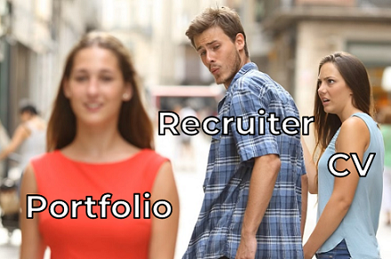

# Software Engineer Portfolio

### Welcome to Developer's page!

The portfolio is created for any interested IT specialist such as Researcher, Recruiter, HR, PM or Technical Specialist. 
The portfolio shows interesting facts about my programming experience and personal qualities. 
The portfolio consists of additional topics which are NOT included in my CV.

Here we go:

- [About](#about)
- [Project Feedbacks](#project-feedbacks)
- [Project Challenges](#project-challenges)
- [Leadership Experience](#leadership-experience)
- [Self-Education](#self-education)
- [Project Changing](#project-changing)

# About

Having **Java** as a primary skill, I‘ve been doing commercial development for **5 years** so far.
Working on Backend, REST API, Frontend, Cloud, Desktop apps,
I‘ve got experience with such **skills** as Java 8, JavaEE, Spring, AWS, SQL, JavaFX, Git, Scrum, Windows.
I've come across different **stages** of development such as Research, Software Design, Implementation, Testing, Deployment.
In addition to development itself, I had wide range of responsibilities: from Requirements Clarification to Product Release.

Thanks to fluent **English** and good soft skills, I‘m an efficient **Team Player** even in case of international teams.
In fact, I’ve been communicating with foreign colleagues and stakeholders for more than 2 years already.
I consider myself as a responsible person and also take care about others.
I have production experience of **Team Leading** and was a Mentor for education programs.
Personally, I'm happy to share experience and help others. Colleagues often ask me for advice.

I'm always open to **feedback** about my work. 
On each project, my professional and personal qualities met or even exceeded expectations.
At the same time, I see the ways for self-improvement and continue working on my hard, soft, and leadership skills.
Currently, I'm recognized as a Senior and for the future I plan to take Lead Software Engineer position.

# Project Feedbacks

#### EPAM Systems
  - March 2023. 
    [Customer Feedback](resources/pictures/feedbacks/2023-March-EPAM-Summary-Feedback-from-Customers.PNG) 
    *Description:* 
    Half-year summary as part of constant feedback process. 
    Collected from **Product Owner**, **Scrum Master** (customer side) and **Delivery Manager** (EPAM side) feedbacks.
    According to my Resource Manager (who shared more details in person), 
    feedbacks were quite positive and customers appreciated my contribution.
    As a result, I was paid an extra bonus.
  
  - September 2022. 
    [Customer Feedback](resources/pictures/feedbacks/2022-September-EPAM-Summary-Feedback-from-Customers.PNG) 
    *Description:* 
    Half-year summary as part of constant feedback process.
    Collected from **Product Owner**, **Scrum Master**, **Tech Lead** (customer side) feedbacks.
    General impression is good: I did great job and also had some points to improve.
  
  - June 2022. 
    [Level-up Feedback 1](resources/pictures/feedbacks/2022-EPAM-LevelUp-Feedback-from-TeamLead.PNG) 
    and [Level-up Feedback 2](resources/pictures/feedbacks/2022-EPAM-LevelUp-Feedback-from-TechLead.PNG) 
    *Description*: 
    Part of assessment preparation. When I was applying for Senior level, 
    I asked **Team Lead** and **Tech Lead** (EPAM side) for feedback.
    This helped assessment committee to decide whether I'm ready to be promoted.
    According to these feedbacks I was recognized as a Senior.
    Finally, I got promoted.

  - June 2021. 
    [Project Feedback](resources/pictures/feedbacks/2021-June-Simple-Project-Feedback-from-TeamLead.PNG) 
    *Description:* 
    Half-year simple one as part of constant feedback process.
    Asked current project **Team Lead** (EPAM side).
    Summing up, I was recognized as an excellent Key Developer and good Team Player.
  
  - January 2021. 
    [Project Feedback](resources/pictures/feedbacks/2021-January-Simple-Project-Feedback-from-Dev.PNG) 
    *Description:* 
    Simple one as part of constant feedback process.
    Asked current project **Developer** (EPAM side) where I played Lead Developer role.
    That time, I didn't follow some coding best practices.
    In general, I was friendly Lead and quite effective Developer at the same time.

#### Institute of Radio Astronomy

  - September 2020. 
    [Quit Project Feedback](resources/pictures/feedbacks/2020-September-RINANU-Quit-Project-Feedback-from-ProjectManager.PNG) 
    *Description:* 
    Quit feedback to sum up the entire work path on a project. 
    Asked **Project Manager** with whom I worked most of the time.
    There are original and English versions.
    Leaving this project, I left successfully implemented application as well as positive impression about myself.

# Project Challenges

Overview of the most challenging tasks, taken actions and achieved results:

#### 2021 - My first App Improvement

Challenges with app improvement to make it ready for production: 
Bug Fixing, Codebase Refactoring, Extension, Local Testing, Remote Debug, Knowledge Transfer. 
Please, visit [this page](resources/projects/2021-MY-FIRST-APP-IMPROVEMENT.md) for details.

#### 2020 - My first project at EPAM

Challenges with wide range of responsibilities: 
Requirements Clarification & Demo, Research, Development, Team Leading. 
Please, visit [this page](resources/projects/2020-MY-FIRST-PROJECT-AT-EPAM.md) for details.

#### 2019 - My first Complex App

Challenges with implementation of multifunctional app from scratch: 
Technologies Research, Requirements Clarification, Architecture, Development, Maintenance and Expansion,
Integration Testing, Acceptance Testing, Packaging and Cross-Platforming. 
Please, visit [this page](resources/projects/2019-MY-FIRST-COMPLEX-APP.md) for details.

#### 2018 - My first Commercial App

Challenge with finding decoding algorithm. 
Please, visit [this page](resources/projects/2018-MY-FIRST-COMMERCIAL-APP.md) for details.

# Leadership Experience

Cases where I organized and supported processes for work and education:

#### Project Team Leading

- Oct 2021 - Dec 2021. Lead Developer on a 3-month project. 
  Organized work in a team of 3 developers. Was in charge of work planning, meeting holding, development support.

#### EPAM Educational Programs

- Jul 2022 - Oct 2022. Mentor in Pre-Production program: \[RD Java Lab Summer 2022\]. Supported 5 students.
- Oct 2021 - Feb 2022. Mentor in Pre-Production program: \[RD Java Lab Autumn 2021\]. Supported 2 students. 

#### Math Teaching

- 2017\. Private Tutor: High Math for students. Supported 4 students.
- 2016\. Private Tutor: Mathematics for schoolchildren. Supported 8 students.

# Self-education

Working on hard and soft skills, I've been using different kinds of learning and have next achievements so far:

#### EPAM English classes. Completed 9 trainings:

  - Apr 2023 - Jul 2023 (26 live sessions). English for Virtual Communication (B1+/B2/B2+).
  - Oct 2022 - Apr 2023 (41 live sessions). Business English (B1+/B2).
  - Sep 2022 - Nov 2022 (17 live sessions). IT Grammar in English (B1+/B2).
  - Jun 2022 - Jul 2022 (8 live sessions). English for Socializing (B1/B1+).
  - Mar 2022 - Jul 2022 (17 live sessions). IT Grammar in English (A2+/B1).
  - Jan 2022 - Feb 2022 (10 live sessions). Project Interviews in English (A2+/B1/B1+).
  - Nov 2021 - Dec 2021 (11 live sessions). Breaking the Language Barrier in English (A2+/B1).
  - Apr 2021 - Oct 2021 (40 live sessions). Business English (A2+/B1).
  - Mar 2021 - May 2022 (10 live sessions). English Speaking Club (B1/B2/C1/C2).

#### LinkedIn Learning. Completed 17 self-study courses:

  - Apr 2023. [Learning REST APIs](https://www.linkedin.com/learning/learning-rest-apis).
  - Mar 2023. [SQL vs NoSQL: Which Database Type Is Right for You?](https://www.linkedin.com/learning/sql-vs-nosql-which-database-type-is-right-for-you).
  - Sep 2022. [Spring Boot 2.0 Essential Training](https://www.linkedin.com/learning/spring-boot-2-0-essential-training-2).
  - Sep 2022. [Learning Spring with Spring Boot](https://www.linkedin.com/learning/learning-spring-with-spring-boot-13886371)
    with my [repository](https://github.com/Yevhen-Tkachenko-1/Spring-Boot-Demo-Application) for exercises.
  - Sep 2022. [Git: Branches, Merges, and Remotes](https://www.linkedin.com/learning/git-branches-merges-and-remotes).
  - Aug 2022. [AWS Essential Training for Developers](https://www.linkedin.com/learning/aws-essential-training-for-developers-2019)
  - Aug 2022. [Git Essential Training: The Basics](https://www.linkedin.com/learning/git-essential-training-the-basics-2019).
  - Jul 2022. [Java EE: Servlets and JavaServer Pages (JSP)](https://www.linkedin.com/learning/java-ee-servlets-and-javaserver-pages-jsp).
  - Nov 2021. [Learning Terraform](https://www.linkedin.com/learning/learning-terraform-2020).
  - Oct 2021. [Building Full-Stack Apps with React and Spring](https://www.linkedin.com/learning/building-full-stack-apps-with-react-and-spring)
    with my [repository](https://github.com/Yevhen-Tkachenko-1/Full-Stack-Demo-Application-with-Spring-and-React) for exercises.
  - Oct 2021. [Advanced SQL for Query Tuning and Performance Optimization](https://www.linkedin.com/learning/advanced-sql-for-query-tuning-and-performance-optimization).
  - Aug 2021. [Spring: Framework in Depth](https://www.linkedin.com/learning/spring-framework-in-depth-2)
    with my [repository](https://github.com/Yevhen-Tkachenko-1/Spring-Demo-Application) for exercises.
  - Aug 2021. [Spring: Test-Driven Development with JUnit](https://www.linkedin.com/learning/spring-test-driven-development-with-junit).
  - Aug 2021. [Introduction to Linux](https://www.linkedin.com/learning/introduction-to-linux).
  - Aug 2021. [Programming Foundations: Algorithms](https://www.linkedin.com/learning/programming-foundations-algorithms)
    with my [repository](https://github.com/Yevhen-Tkachenko-1/Java-SDK-Research-and-Play) for exercises.
  - Aug 2021. [Practical Test-Driven Development for Java Programmers](https://www.linkedin.com/learning/practical-test-driven-development-for-java-programmers).
  - Jul 2021. [Learning Cloud Computing: Core Concepts](https://www.linkedin.com/learning/learning-cloud-computing-core-concepts-13966302).

#### EPAM Learning. Completed educational program:

- Jun 2022 - Aug 2022. Cloud Platforms for developers - AWS Developer. 
  Completed 7 self-study modules with a Mentor review:
    - AWS Essential, AWS Account
    - IAM, S3, EC2, VPC
    - Cloud Formation

#### Book Library

- 2023\. Designing Data-Intensive Applications - Martin Kleppmann.
- 2020\. Java XML and JSON: Document processing for Java SE - Jeff Friesen.
- 2019\. Kotlin - Head First.
- 2019\. Android Development - Head First.
- 2019\. Design Patterns - Head First.
- 2019\. Pro JavaFX 8: Building Desktop, Mobile, and Embedded Java Clients - Apress.
- 2018\. Learn JavaFX 8: Building User Experience and Interfaces - Kishori Sharan.
- 2018\. JavaFX 8: Introduction By Example - Apress.
- 2018\. Java: A Beginner's Guide - Herbert Schildt.
- 2018\. Effective Java - Joshua Bloch.
- 2018\. The C++ Programming Language - Bjarne Stroustrup.
- 2018\. The C Programming Language - Brian W.Kernighan, Dennis M.Ritchie.

# Project Changing

My thoughts on changing the project: 
- When is the right time to look for new opportunities?
- What to check to find the best fit?

Personally, I really like stable companies and projects where I can work for a long period, e.g. 2 years and more.
Long term assignment is profitable for both: developer and company.
For example, working on large enterprise apps, first you have to spend some time and resources to get to know the project.
It's kinda an investment that later brings benefits such as satisfaction from your work, 
possibilities to make bigger impact and finally, bringing more value to the project.
Even when building large app from scratch, you need to define the architecture and establish the development processes 
that is also beneficial only in long term run.

Such commitment also has other side.
That's great if on your project you always have opportunities and space to grow.
However, at some projects, at some point (for example in 2 years of development),
you may find yourself doing the same job day-to-day, and it can't be changed.
In such situations I would consider to switch to another project.

I realize importance and risks of such decision for myself, my current project and future project.
In such cases, first of all, I talk about my concerns with project managers.
If we can't find solution, there are many other projects to join.
I try to find the best fit and finally accept the offer very carefully.
Joining new project is weighted decision that means I commit for long term cooperation.

So, I have some points to check when applying for new projects:

- Why is position open?
- Project Domain: what is it about? what is outcome? which impact does it make?
- Tech Stack, e.g. key language, frameworks, versions, databases.
- Development Type, e.g. full cycle, support, migration.
- Development Responsibilities, e.g. design, research, implementation, delivery.
- What do regular tasks look like? Any specific work scope for newcomer? Any specific release dates? Any urgent deadlines?
- Development Methodology, e.g. Scrum. Any specific processes? How many regular meetings?
- How is the task formulated? How developer is involved in requirements clarification, testing and deployment?
- Project Team, e.g. size, kinds of specialists, presents of local and foreign colleagues.
- Interaction with customers and English-speaking colleagues.
- Is work laptop provided? Which OS, e.g. Windows, Linux, Mac.
- Project Tools, e.g. IDE, VCS, apps for chatting, online meetings, task tracking.
- Are there less experienced colleagues to play mentor role?
- Are there more experienced colleagues to ask for help?
- Work hours (time zone dependencies).
- General work tempo: Any constant pressure to be fast? Any lack of tasks or presence of complex processes, so it gets slow?
- Is there overtime work? If so, is it compensated?
- Is there activity tracker, e.g. mouse movement tracking, screen capture?
- Onboarding: Are there any flow and materials to help newcomer understand project? How much time allocated?
- Probation period: Is it present? How long does it take? In which period is it expected for newcomer to get started with regular pace?
- Project Stability: Will there be work in 1 year?
- Project Perspectives: Is there space to grow and take more complex tasks and next level responsibilities?
- Office, its location, workplace and benefits.
- Non-project activities, e.g. team-buildings, events, conferences, hackathons.
- Education support, sport compensation, health insurance.
- Are there any business trip? (especially interesting if it helps you meet your implementation in real life)
- Additional bonuses for good performance, successfully released features, resolving additional tasks asked by customer, providing better solution. 
- Compensation Range for the position.
- Compensation Review: What to do to get it? How often? Regular or by asking? Which amount is it possible to have in 2 years?

# Programming Habits

Some tips and approaches for programmers that I noticed and personally found useful:

- Work from office helps be more efficient and keep work-life balance.
  Also, it's more secure and company is less concerned about employee's doings.
- Refactoring helps fix bugs.
  For example, in `Java` it's nice to use `Stream API`, but sometimes it's overcomplicated.
  When we have many invocations in a row, such code is not possible to understand.
  I would rather have plain Java implementation then complex constructions.
  This way, refactoring helped me several times to find an issue.
- Writing documentation helps better understand what you've done,
  structurise gained knowledge and release memory.
  Once important details are covered, you can forget about it and easily switch to the next task.
- Adjusting the video playback speed helps learn quickly.
  I like watching tutorials, but sometimes it's very detailed and takes much time.
  Advice is quite simple but helped me a lot.
  Most recordings have good quality, so it's possible to speed up playback to 1.5 without losing understanding.
  With this my learning becomes faster and as a result, I feel comfortable to continue learning this way.