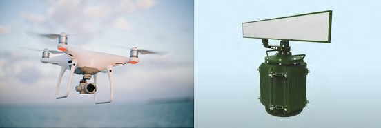

### 2018 - My first Commercial App

There was **need** to test a Radar Station.
For this, was used a Quadcopter which collects flight logs as binary files. 
Such files you can not directly open and read.

My **task** was to make desktop app which parses log files and creates human-readable text.
It was not hard in terms of programming itself, but **challenge** was the binary files. 
To parse them, you should know how data is written.
There was no such algorithm for encoding along with the Quadcopter.
Moreover, there was no guarantee that the algorithm exists in the public access. 

My **actions** were aimed at searching for the algorithm on the Internet. 
I used different approaches for effective search, posted questions on the forums, 
wrote to Quadcopter support and reviewed tones of articles.
Fortunately, I found the algorithm in about 2 weeks, and then started implementation. 
Even though I had no experience with desktop,
I quickly figured it out, and it took me less than 1 month to developed app from scratch.

As a **result**, research team was able to test Radar Stations using this app as a custom(trusted) solution.