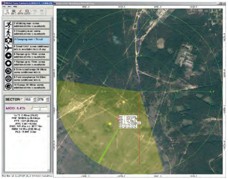

# 2019 - Complex App

Working at RINANU, I was a member of big project named OKO.
This department develops **Radar Stations** including scientific research, hardware and software implementations.

My **task** was to develop new Desktop app for using Radar Stations.
There was already existing Radar Client, however, it had limitations as was made by outdated technologies.
I supposed to implement similar app which has better view and new functional features.

There is how **previous** implementation looks like:

The picture on this slide shows how implementation looks like.
Below you can see diagram of high-level design.

In general, I was working with Project Manager to clarify requirements and provide results.
I was trusted to deal with implementation by myself.

Once I reviewed requirements at high level, I started research on technology stack.
There were 2 main options, Java/JavaFX and .Net.
I implemented simple POCs for them and we decided to use Java.

The biggest challenge for this project was the huge number of application features.
So, I started implementation from completing tasks one by one.
However, at some point it became hard to maintain codebase.
To resolve this problem, I was doing code refactoring and keeping project structure clean and clear.
It helped for some period, but was not enough for the large application.
Then, I started thinking about project architecture and decided to use design patterns.
Once I implemented MVC pattern it became clear which code I need to change to expend application.
As a result, I was able to add new features quite fast.

Moreover, this MVC implementation has additional component named Binder.
It makes Model and View isolated using Observable pattern.
Thanks to this, I was able to test application parts independently.
I made integration tests for UI and for data processor.
Every time I implemented new feature, I was performing acceptance tests.
For this I was running application with connection to radar simulator.
This server acts exactly as real radar station, so my testing was quite effective

Also, I was working on application self-packaging for Windows and Linux.
Before I left this project, I wrote detailed documentation for newcomers to get started.
I covered project architecture and main stages of development