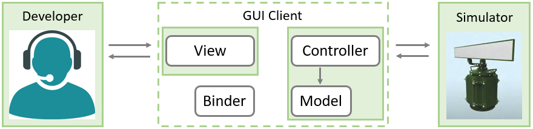

# 2019 - Complex App

Working at RINANU, I was a member of big project named OKO.
This department develops Radar Stations including scientific research, hardware and software implementations.

My **task** was to develop new Desktop app for using Radar Stations.
There was already existing Radar Client, however, it had limitations as was made by outdated technologies.
I supposed to implement similar app which has better view and new functional features.

While working on it, I faced challenges at each stage of development:

- First question was technology stack. It was not clear which language and tools to use for development.
    There were 2 main options: `Java/JavaFX` and `.Net`. 
    To help us decide, I reviewed pros and cons of each and implemented POCs. 
    Java was chosen as perfect fit for requirements and complexity.
  
- Before development can be started, it's important to be clear with TBD. 
    I managed to learn how to use current OKO Client and had it as an example. 
    Another requirements, I was clarifying with Project Manager.
    It's worse to notice, that there were no other Java developers, 
    and I was trusted to deal with implementation by myself.

- The biggest challenge for this project was the huge number of application features.
    So, I started implementation from completing tasks one by one.
    However, at some point it became hard to maintain codebase.
    To resolve this problem, I was doing code refactoring and keeping project structure clean and clear.
    It helped for some period, but was not enough for the large application.
    
    Then, I started thinking about project architecture and using design patterns.
    I refactored codebase to implemented MVC pattern. 
    It became clear which code I need to change to expend application.
    
    As a result, I was able to add new features quite fast.

    There is diagram of high-level design:

    

- Unlike standard MVC, this one has additional component named Binder.
    Here Model and View are isolated thanks to Observable pattern.
    
    As a result, I was able to test application parts independently.
    
    I made **integration tests** for UI manual testing (without connection to Radar Server) 
    and Data Processor testing (using mock UI):

    

- Every time new feature was implemented, this supposed to be accepted by Project Manager.
    For doing **acceptance testing**, PM and I was running application with connection to Radar Server simulator.
    This Server acts exactly as real Radar Station, so our testing was quite effective.
    
    As a result, I was able to get quick feedback and make changes as needed:

    

Finally, I was working on application self-packaging for Windows and Linux.
Before I left this project, I wrote detailed documentation for newcomers to get started.
I covered project architecture and main stages of development

As a **result**, OKO department got new GUI Client app, that has better view and new features 
(such as cross-platforming, embedded 3D view, internationalization) which was not possible to implement with previous app. 

There is how **previous** implementation looks like:

There is how **new** implementation looks like:

Also, sources of the app were used by foreign colleagues to build their own OKO Client. 