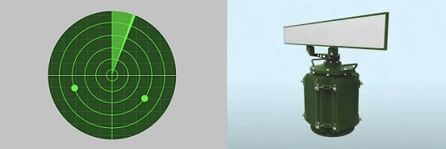
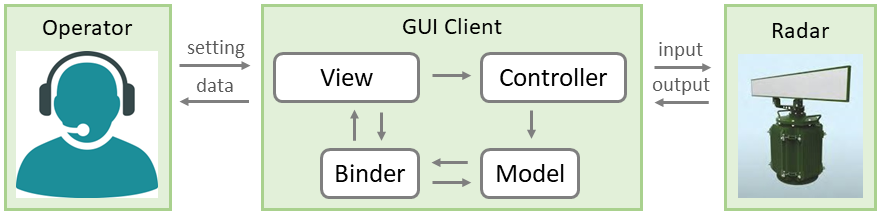
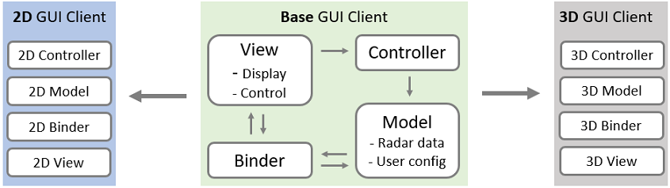
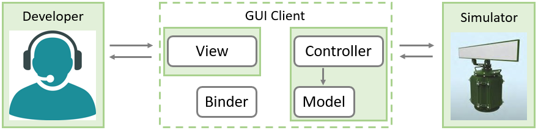
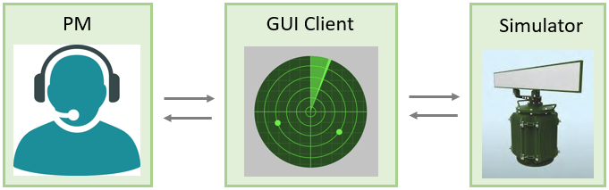
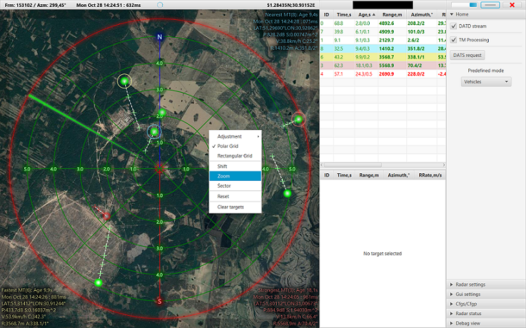
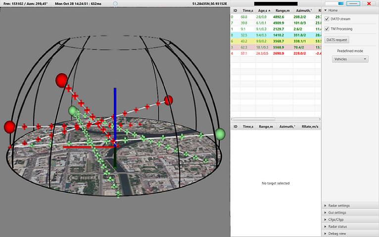

# 2019 - My first Complex App

Working at RINANU, I was a member of big project named OKO.
This department develops Radar Stations including scientific research, hardware and software implementation:

My **task** was to develop new Desktop app for using Radar Stations.
There was already existing Radar Client, however, it had limitations as was made by outdated technologies.
I supposed to implement similar app which has better UI/UX and new functional features 
(such as cross-platforming, 3D graphics, internationalization).

While working on it, I faced challenges at each stage of development:

- Start point was **technology stack** research.
    It was not clear which language and tools to use for development.
    There were 2 main options: `Java/JavaFX` and `.Net`. 
    I reviewed pros and cons and implemented POCs. 
    As a **result**, it became clear that `Java` is a good choice to meet requirements with a simpler implementation.
  
- I pay attention to be clear about **requirements**. 
    First, I got to know how to use the current Radar Client as an example and had been coming back to it constantly. 
    Sometimes, I reviewed sources of this app to gain general code such as calculation functions.
    Another requirements regarding deep details or new features, I had been clarifying with Project Manager. 
    As a **result**, features were implemented as expected. Moreover, I spent time and resources in a quite efficient way: 
    there was no unnecessary work on wrongly understandable requirements.
    
- It's worse to notice, that there were no other Java developers,
    and I was trusted to deal with implementation by myself.
    The biggest challenge for **development** was the huge number of application features.
    So, I started implementation from completing tasks one by one.
    However, at some point it became hard to maintain codebase.
    To resolve this problem, I was doing code refactoring and keeping project structure clean and clear.
    This helped for some period, but was not enough for the large application.
    Then, I started thinking about project architecture and using design patterns wider across application.
    I refactored codebase to implemented MVC pattern, 
    and it became clear what code needs to be changed to expend application. 
    As a **result**, I was able to add new features quite fast. 
    There is diagram of high-level design and data flow:

    

- Another **challenge**, is that application was targeting to use by different types of Radar Station: 2D and 3D.
    Such Radars have something in common, but also differences in UI as well as in Data.
    Once this requirement took place, I refactored codebase and changed development approaches 
    to have 2 separate applications. At the same time, 
    I left original app as a Base part where placed as much implementation as possible. 
    Target apps have independent slices with specification, 
    and most of the dependencies between app components are defined in Base app. 
    As a **result**, bigger part of code was in one place and reused by 2 applications 
    so that code duplication is minimal. 
    There is diagram of cross-app design at high level:

    
    

- Unlike standard MVC, this one has additional component named Binder so that Model and View 
    are isolated (using Observable pattern).
    Such approach helped a lot with application **integration testing**.
    Having additional layer of UI-side data, I was testing UI manually even without actual Radar Data.
    The second part for testing was Data Processor, for which I implemented mock UI 
    and was able to test interaction with Radar Server directly. 
    As a **result**, it was easy to test UI changes quickly (without the need connect to Radar Server).
    Also, there was a way to test Data Processor at low level (without impact from UI side). 
    There is diagram of integration testing approach:

    

- Every time new feature was implemented, this supposed to be **accepted** by Project Manager.
    For this, I found a way to package app as a single `.jar` file and quickly deliver it. 
    PM and I were running application with connection to Radar Server simulator.
    This Server acts exactly as real Radar Station by producing Target Data at runtime 
    and sending large batches of data up to 50 times per second. 
    As a **result**, our testing was quite effective, I was able to get quick feedback and make changes as needed. 
    There is diagram of acceptance testing approach:

    

- Also, I was working on application self-packaging (and testing) for Windows and Linux. 
  There was challenge with performance while running app on Linux. 
  I tried to check different versions of app and found which component causes the issue.
  Then I replaced implementation with more suitable for both Windows and Linux. 
  As a **result**, app can be considered as truly cross-platform.
  
- Finally, I was responsible for knowledge transfer. Before left this project, 
  I made rich technical documentation for newcomers to get started. 
  There were covered project architecture and development stages.

Summing up, my **impact** on this project is that OKO department got new GUI Client app for Radar Stations. 
There are main achievements:

- Now Radar Operators can work with 3D Radar Stations.
- Now Radar Operators can work on different platforms including Windows, Linux, and macOS.
- Now Radar Operators can work with modern UI, have more convenient way to navigate through app, and more settings to customize view.
- Now Radar Operators can work in different countries, more legally, thanks to target language support.
- Now Developer Team has established processes and clear architecture for supporting New OKO Client.
- Now Foreign Developers use our source code to build their own OKO Client.

For comparison, there is how **previous** implementation looks like:

There is how **new** implementation of 2D Client looks like:

There is how **new** implementation of 3D Client looks like:

