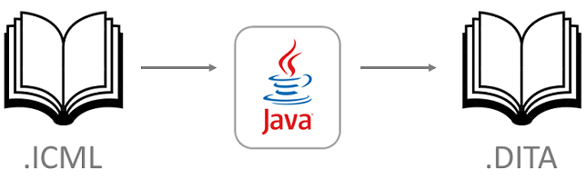

### 2020 - My first project at EPAM

There was **need** for USA company to implement Tool that allows Book Publishers to take step back in their workflow.
Such app is supposed to convert `.XML` based manuscript from `.ICML` to `.DITA` format.
For this task was allocated fixed budget for 3 months and collected small team of 3 Developers.
In this team I was Lead Developer that responsible for Requirements Clarification, Development, Demo, and Release.

It was short-term experience, however, full of challenges:

- First of all, it was my first work in an IT company. 
  Moreover, it's large IT company where additional **processes** make difficulties for newcomers.
  I supposed to spend some time to get to know how to use internal company services.
  Fortunately, I managed to do it fast and then my work became more effective.

- From every beginning, I started **communicate** with USA customers which was really hard.
  My English level was not enough, and personally I was not confident.
  In order to make communication smoother, I tried to replace speaking with writing where appropriate.
  Anyway, we had weekly demos as mandatory live sessions.
  So, I had been preparing for this in advance.
  I had been training speech and creating materials for visual support.
  Also, I immediately considered to attend English classes and learn language strenuously. 
  As a **result**, customers were able to see development progress and provide feedbacks.
 
- Before start development, our team was supposed to find **implementation way**. 
  Customers expected us to integrate some existing open-source solution.
  Our team spent about 1 month for searching for working tool, but actually, there was no such available.
  This situation put us under the pressure by fact that we need implement solution from scratch in 2 months.
  To make points clear, I made a work plan and divided implementation into stages and tasks. 
  As a **result**, we realized that it's possible to meet deadlines and our team started development without worries.

- First, I designed application structure. 
  Then our team started **development** which seemed to me not so hard.
  I had been holding daily meeting where we were discussing all the details.
  Development was smoothly for me, but not for teammates.
  They had good programming skills, so it was not clear what is the problem.
  Finally, I realized that developers were not sure about tasks requirements.
  I decided to change the way we had meetings.
  I started preparing my solution in advance to not spend time for expressing meaningless thoughts right in a meeting.
  I let teammates speak first, so that they started speak more about concerns and feel welcome to provide their solution.
  Also, another mistake was that I took a lot of implementation to myself, 
  so that there were many dependencies between us and teammates supposed to deal with my code.
  So, I delegated more work to devs and separated it in accordance with task assignee. 
  As a **result**, we started act as a team and development became more effective.

Summing up, my personal feeling is that it was not a perfect development in terms of processes. 
Anyway, our team managed to implement pilot version of the app 
and looks like customers were satisfied.
Later, I got to know, that in comparison with other cases on this project, 
our team showed quite good outcome working independently: attention from EPAM Delivery Manager was minimal.