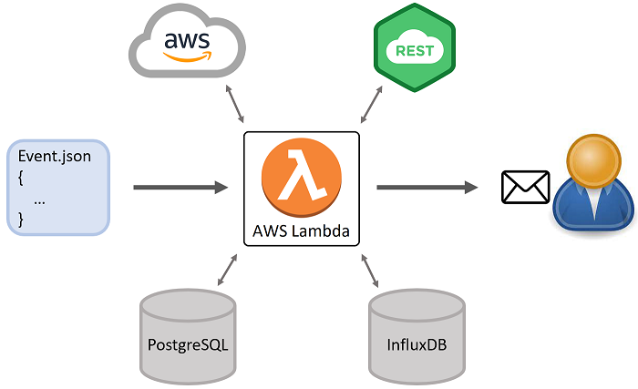

### 2021 - My first App Improvement



There was automated Cloud Pipeline which had final element as **AWS Lambda** function written in Java.
AWS Lambda was a complex one which parses custom events, works with PostgreSQL and InfluxDB, calls other services by HTTP, 
connects to AWS services through AWS SDK, sends emails, processes data, and generates MS Word document.
I joined this project when most of the active development was done, but entire implementation couldn't be considered as stable.
Project **goal** at that stage was to fix bugs and add new features as was requested by end users.
For Cloud Pipeline there was a team of DevOps, Performance Analyst, Team Lead,
where I played Key Developer role by working on AWS Lambda improvement.

During development, testing and delivering, I faced several **challenges**:

- There were **calculations** and results didn't meet expectations.
  Starting fixing bugs, I reviewed functions and used debugger to check code line by line.
  Still, it was not clear where was mistake as complex constructions were used. 
  So, I decided to do refactoring.
  I divided big functions into smaller ones, used plain java code instead of Stream API where it was overcomplicated and so on.
  While refactoring, issues were appearing one by one, so it was easy to find cause and solution.<br>
  As a **result**, all bugs were fixed and there were no bugs in further development.

- There was an issue with **performance**.
  AWS Lambda was expected to have run time from 5 to 15 minutes, but actually it was more than 20 minutes.
  As previous developer suggested, there were a lot of calculations, so was implemented solution with multithreading.
  This helped for first, but didn't resolve root cause. 
  Unexpectedly, time of execution was increasing from time to time.
  I started explore this bug and concluded that issue was not with number of calculations.
  Using debugging and additional logging, I discovered that one of the external Services takes long time for response.
  I pointed it out, and performance issue was resolved on the other side.<br>
  As a **result**, AWS Lambda run time got back to its expected bounds.

- While working on new features, I faced issues with application **code quality**.
  There was a lot of code duplication, and it was hard to integrate new components.
  The structure of the app was built based on a data model, but not on a logical algorithm steps.
  Literally, for each peace of data were performed several processing steps, something like this:
  
  > **Disclaimer!** Next code shouldn't be considered as production sources: it's created for docs only, reflects the general idea and doesn't have any actual implementation

  ```
  /**
   * High level method - doesn't have an explicit passing of 1-5 steps
   */ 
  public void handleRequest(InputStream inputStream, OutputStream outputStream, Context context) {
        // Step 1
        AppEvent event = eventService.parseEvent(inputStream);
        // Steps 2, 3, 4 are hidden in low level method
        DocxFile document = documentService.generateDocument(event);
        // Step 5
        outputService.sendDocument(document);
  }
  /**
   * Low level method - responsible for more then one functionality and "knows" about high level elements
   */ 
  public void populateParagraph(Event event, DocxFile document) {
        // Step 2
        ParagraphData data = modelService.collectParagraphData(event);
        // Step 3
        ParagraphCalculetedData paragraphCalculetedData = calculationService.calculateParagraphData(data);
        // Step 4
        documentService.populateDocument(paragraphCalculetedData, document);
  }
  ```
  My solution was to have simple algorithm function at high level, something like this:
  ```
  /**
   * High level method - have an explicit passing of 1-5 steps
   */ 
  public void handleRequest(InputStream inputStream, OutputStream outputStream, Context context) {
        // Step 1
        AppEvent event = eventService.parseEvent(inputStream);
        // Step 2
        AppData data = modelService.collectData(event);
        // Step 3
        AppCalculetedData appCalculetedData = calculationService.calculateAppData(data);
        // Step 4
        DocxFile document = documentService.generateDocument(summary);
        // Step 5
        outputService.sendDocument(document);
  }
  ```
  and have separate implementations at low level, something like this:
  ```
  /**
   * Low level method - responsible only for one functionality and works only with low level objects
   */ 
  public ParagraphData collectParagraphData(EventPart eventPart) {
        // Step 2 implementation
        // ...
  }
  /**
   * Low level method - responsible only for one functionality and works only with low level objects
   */ 
  public ParagraphCalculetedData calculateParagraphData(ParagraphData paragraphData) {
        // Step 3 implementation
        // ...
  }
  /**
   * Low level method - responsible only for one functionality and works only with low level objects
   */ 
  public DocxParagraph generateParagraph(ParagraphCalculetedData paragraphCalculetedData) {
        // Step 4 implementation
        // ...
  }
  ```
  Also, there were unappropriated uses of **Design Patterns**.
  For example, *Chain of Responsibility* was used where it was possible to simply have the switch-case construction.
  I discussed these points with stakeholder representative, and we agreed on refactoring.
  There was a bit of pressure as big part of code supposed to be updated and I felt personal responsibility for this decision.
  I worked really hard and sometimes overtime and finally, refactoring was successfully implemented.<br>
  As a **result**, it became easier to add new features, debug and test application.

- Regarding testing, there was good unit coverage, but was no implementation for **integration testing**.
  Refactoring described above, helped me to develop tests to check results of each main step of application algorithm.
  Regarding **end-to-end** local testing, it was possible to run app, but it took much time.
  For example, working on Docx library, you have to do several little changes in a row to get expected result.
  Each time you do simple change in 10 seconds, then you should wait 10 minutes to check result.
  So, I decided to add caching level to application testing.
  With this you can save data with first test run and then reuse cache instead of calling external Services repeatedly.<br>
  As a **result**, I was able to test each app component independently at high level,
  and time for end-to-end testing was decreased from ~10 minutes to ~10 seconds.

- My responsibilities also included deployment and **acceptance** running.
  Sometimes, there were issues with running AWS Lambda remotely which were not reproducible locally.
  It was a problem to analyze and resolve such issues as there were no logs output.
  Logging was implemented in app code, but due to some settings it was not possible to see output remotely.
  So, I had to implement different logging approach.
  I developed custom logger that accumulates info during app running and finally, sends text file to storage.
  It worked even in case AWS Lambda execution was failed.<br>
  As a **result**, it became possible to investigate and fix bugs that are specific to production environment.
  
- Another challenge was a **knowledge transfer**. 
  Our team was about to finish active R&D and hand it over to a new team for support.
  There was no Java Developer on the new team, so I was asked to create as much documentation as possible for the future.
  Fortunately, I really like do this and I made kinda tutorial for newcomers to get started.
  Working on the documentation, I covered AWS Lambda basic overview, project structure, 
  its relations with other services, described in details each development stage with step-by-step instructions.
  In addition, I recorded videos with screen sharing and voice support for main topics.<br>
  As a **result**, (got to know later) member from the new team was able to work with AWS Lambda 
  even with minimal experience with Java and without getting help from developers of this app.

**Summing up**, our team successfully completed active stage of R&D:
released stable version of Cloud Pipeline and passed it to support.
My contribution was not limited to AWS Lambda release,
but also I made internal improvements: codebase was refactored
and development approaches were established that had positive impact to further application support.