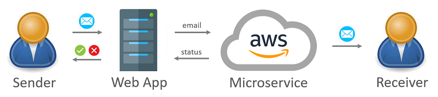

*Go back to [**Project Challenges**](../../README.md#project-challenges)*

# 2021 - My first Cloud Development

When I joined the USA Enterprise project, I was assigned to a Scrum team that was on initial phase of a Microservice development.
There was a goal to build service for Email sending and Delivery Status processing that is based on Spring API and AWS components.
There were Team Lead and Tech Lead who were occupied with other tasks and entry level Java Developer who worked on implementation.
It was expected that my contribution speeds up the development process and helps achieve release.
My **task** was to find implementation way for email status processing, finalize POC, improve REST API, and support deployment automation.

Working simultaneously in Dev and DevOps teams, I had challenges with development and CI/CD:

- I started work by **investigating** AWS components for email status processing flow. 
  It was first time I worked with Clouds, so it was not so easy.
  I discussed possible solution ways with our Tech Lead and started work on POC.
  Using AWS documentation and exploring components by creating and configuring them via AWS Management Console, 
  I managed to build data flow with use of SES, SNS, SQS, Lambda, DynamoDB. 
  As a **result**, working solution was implemented and team was able to provide estimates for entire Service implementation.

- Then, I worked on REST microservice **improvements**,
  including codebase refactoring to meet development principles like SOLID.
  For entire service, I redesigned data flow to get away
  from the quick working implementation to the right solution in terms of architecture.
  There were 2 features combined in AWS Lambda: status parsing and data saving to DB.
  It was decided to have Lambda just for status processing and leave work with DB to Spring REST API. 
  As a **result**, in the further development our team was able to make DB changes easier without touching the Lambda.

- Another challenge was **testing**.
  It was hard to test Service locally as several AWS components are remote only.
  I found quick steps to follow for testing AWS Lambda and REST API and managed to automate some manual work for getting data from remote. 
  As a **result**, developers were able to do end-to-end testing locally, and it was quite fast.

- In DevOps team, I was working on **deployment automation** using Terraform.
  That time "Infrastructure as a Code" term was familiar to me, but I didn't have any experience in this field.
  I spent some time to get basics of using Terraform, and started working on tasks.
  Researching existing infrastructure and using Terraform documentation helped a lot and I managed to develop modules for SQS and Lambda.
  Then I started proactively collaborate with DevOps team to get help with dependencies and code delivery flow.
  Finally, I managed to integrate these modules to infrastructure 
  and supported with other modules (SES, SNS, DynamoDB) from development perspective. 
  As a **result**, all AWS components were deployed as expected 
  and team got engineer who can work on both sides to make Development and Deployment consistent.

**Summing up**, Microservice was successfully implemented, deployed and released in 8 months.
My contribution helped make it faster and with better quality.
This way I started working on a long-term project and showed myself as an effective engineer.
Stakeholders appreciated my performance and I decided to continue working on this project.

*Go back to [**Project Challenges**](../../README.md#project-challenges)*