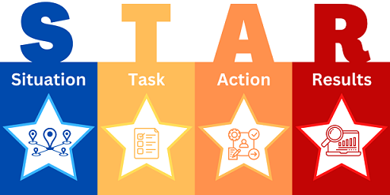

# Project Challenges

Overview of the most challenging tasks, taken actions and achieved results  

### 2022 - My first Enterprise App
Challenges with supporting multi-component app and it's infrastructure:
- Development processes
- Large codebase
- Complex domain
- Dependencies
- Another particular issues

Please, visit [this page](2022-MY-FIRST-ENTERPRISE-APP.md) for details.

### 2022 - My first Cloud Development
Challenges with AWS components selection, configuration and deployment:
- POC
- Testing
- Deployment automation

Please, visit [this page](2022-MY-FIRST-CLOUD-DEVELOPMENT.md) for details.

### 2021 - My first App Support
Challenges with app improvement to make it ready for production: 
- Bug fixes and extension
- Codebase refactoring
- Testing
- Knowledge transfer

Please, visit [this page](2021-MY-FIRST-APP-IMPROVEMENT.md) for details.

### 2020 - My first project at EPAM
Challenges with wide range of responsibilities:
- Requirements clarification
- Research and development
- Team management
- Demo

Please, visit [this page](2020-MY-FIRST-PROJECT-AT-EPAM.md) for details.

### 2019 - My first Complex App
Challenges with implementation of multifunctional app from scratch: 
- Technologies research
- Architecture building
- Maintenance and expansion
- Testing

Please, visit [this page](2019-MY-FIRST-COMPLEX-APP.md) for details.

### 2018 - My first Commercial App
Challenge with finding decoding algorithm.

Please, visit [this page](2018-MY-FIRST-COMMERCIAL-APP.md) for details.
